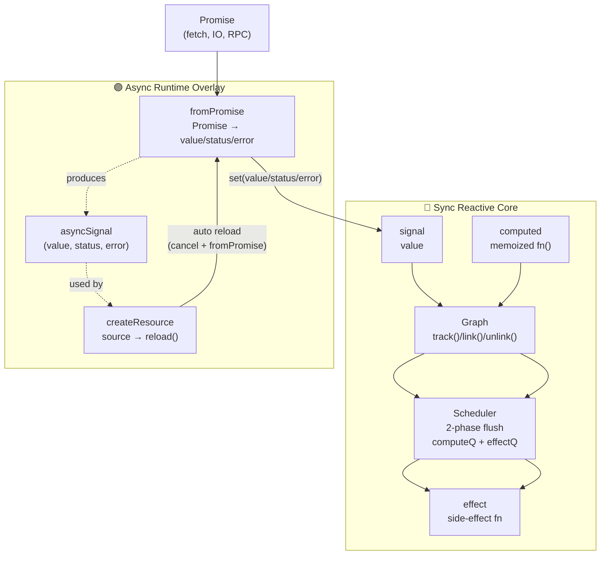

# Signal Kernel
### Fine-grained Reactivity + Async Runtime Kernel (Framework-agnostic)
**Signal Kernel** is a lightweight, framework-agnostic reactive runtime designed to be the minimum viable core for modern UI frameworks.  
It aims to be the smallest possible reactive substrate upon which modern frameworks, compilers, or async dataflow engines can be built.   
It provides:  
- **Signals** — the smallest reactive unit  
- **Computed values** — memoized derivations  
- **Effects** — reactive side-effects  
- **Async Signals** — async state with status + error  
- **Resources** — SolidJS-style reactive async with cancellation  

This project is a meta-runtime:  
not a framework, but the reactive kernel upon which frameworks can be built.  

> ⚠️ This is a v0.x preview. APIs may evolve before v1.0.

---

# Packages Overview
Signal Kernel is modular. Each package is independent and can be used standalone.    
| Package                                 | Description                                                              |
| --------------------------------------- | ------------------------------------------------------------------------ |
| **@signal-kernel/core**                 | Sync reactivity: signals, computed, effects, dependency graph, scheduler |
| **@signal-kernel/async-runtime**        | Async overlay: fromPromise, asyncSignal, createResource                  |
| *(coming soon)* `@signal-kernel/react`  | React adapter                                                            |
| *(coming soon)* `@signal-kernel/vue`    | Vue adapter                                                              |
| *(planned)* `@signal-kernel/kit`        | Convenience package that re-exports everything                           |

---

# Installation

```bash
npm install @signal-kernel/core @signal-kernel/async-runtime
```

or with pnpm:  
```bash
pnpm add @signal-kernel/core @signal-kernel/async-runtime
```

---

# Features
### Fine-grained Reactivity (no VDOM, no component re-runs)
The core provides:  
- `signal()`  
- `computed()`  
- `createEffect()`  
- Deterministic dependency tracking graph  
- Two-phase scheduler (computed → effects)   

The design is similar in spirit to SolidJS/Vue reactivity,
but is *smaller, purer, and framework-independent*.

---

### Framework-agnostic
Signal Kernel does not depend on any UI system.  
It can integrate with:  
- React (via adapter)  
- Vue (via adapter)  
- Solid-like runtimes  
- Custom renderers  
- Server / Worker / Edge runtimes  

---

### Async Runtime (cancellable async state machine)
Built on a composable abstraction stack:  
1. `fromPromise()`  
2. `asyncSignal()`  
3. `createResource()`  

You get:  
- pending → success → error state machine  
- stale request protection (token-based)  
- `keepPreviousValueOnPending` (SWR-like UX)  
- explicit `cancel()` API  
- switchMap semantics when the source changes  

---

# Core Usage
### Signals
```ts
import { signal, computed, createEffect } from "@signal-kernel/core";

const count = signal(1);
const doubled = computed(() => count.get() * 2);

createEffect(() => {
  console.log("doubled:", doubled.get());
});

count.set(2); // logs: doubled: 4
```

---

# Async Usage (Async Runtime)
### Async Signal
```ts
import { asyncSignal } from "@signal-kernel/async-runtime";

const [user, meta] = asyncSignal(() =>
  fetch("/api/user").then(r => r.json())
);

console.log(meta.status()); // "pending"
// later → "success" or "error"
```

### Reactive Async Resource (with auto cancel)
```ts
import { signal } from "@signal-kernel/core";
import { createResource } from "@signal-kernel/async-runtime";

const userId = signal(1);

const [user, meta] = createResource(
  () => userId.get(),
  (id) => fetch(`/api/user/${id}`).then(r => r.json())
);

// Automatically refetches on userId change
userId.set(2);
```
Behavior:  
- Changing source() cancels the previous request  
- Prevents stale async results from overwriting fresh data  
- Pending state keeps previous value unless configured otherwise  

---

# Async Resource State Machine (SwitchMap)
```sql
source() changes
       ↓
cancel previous request (mark stale)
       ↓
start new async request
       ↓
resolve → update value / status / error signals
```

Equivalent to SolidJS `createResource` or RxJS `switchMap`.

---

# Architecture Diagram


---

# 📚 API Overview
### Core
| API                | Description                                   |
| ------------------ | --------------------------------------------- |
| `signal(initial)`  | Smallest reactive unit                        |
| `computed(fn)`     | Lazy, memoized derived value                  |
| `createEffect(fn)` | Reactive side-effect with dependency tracking |
| `batch(fn)`        | Deterministic batch grouping                  |

### Async Runtime
| API                                         | Description                                   |
| ------------------------------------------- | --------------------------------------------- |
| `fromPromise(fetcher, options?)`            | Convert Promise → reactive async state        |
| `asyncSignal(fetcher, options?)`            | Async operation with cancel + metadata        |
| `createResource(source, fetcher, options?)` | Reactive async with switchMap-style semantics |

---

# Roadmap
Planned for v0.x → v1.0:  
- React adapter (hooks)  
- Vue adapter (ref-friendly API)  
- Query/cache layer (optional)  
- SSR support & async graph streaming  
- DevTools inspector  

---

# License
### MIT

---

# Author
**Luciano**  
Exploring fine-grained reactivity and building a modern async-first runtime.  
