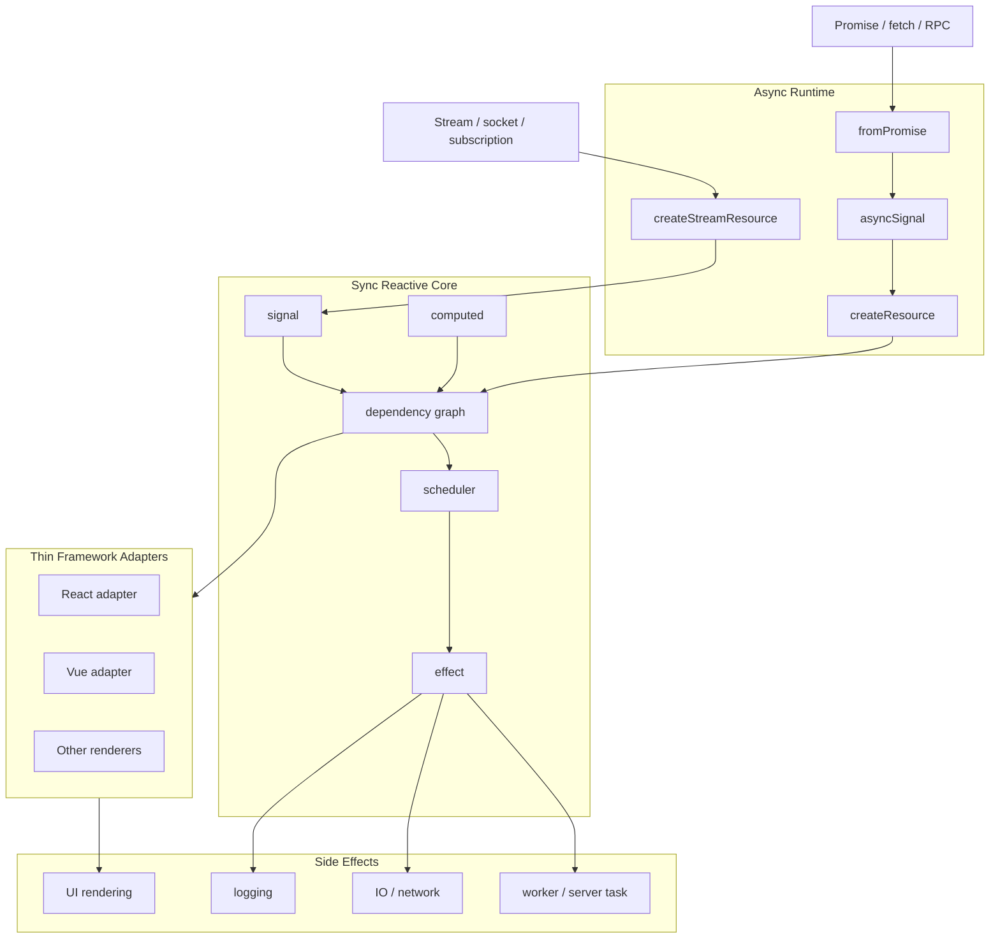

<p align="center">
  
</p>

<p align="center">
  <a href="https://www.npmjs.com/package/@signal-kernel/core"></a>
  <a href="https://www.npmjs.com/package/@signal-kernel/async-runtime"></a>
  <a href="https://www.npmjs.com/package/@signal-kernel/react"></a>
  <a href="https://www.npmjs.com/package/@signal-kernel/vue"></a>
</p>

<h1 align="center">signal-kernel</h1>

<p align="center">
  A framework-agnostic reactive kernel for deterministic sync/async dataflow.
</p>

<p align="center">
  Build the data graph first. Treat rendering as an effect. Connect frameworks through thin adapters.
</p>

<p align="center">
  It models async state as part of the reactive graph, with explicit invalidation, cancellation, and controlled propagation.
</p>

---

## What is signal-kernel?

**signal-kernel** is a lightweight, framework-agnostic runtime for fine-grained reactivity.

It starts with a small synchronous reactive core, then extends the same graph model to async state, resource loading, and streaming scenarios.

Instead of treating async behavior as a completely external side effect, signal-kernel brings it back into the runtime graph as a first-class part of dataflow orchestration.

Most frontend frameworks are rendering-centered, but most product requirements are data-centered.

signal-kernel starts from the data graph instead of the rendering layer.

Business logic, derived state, async resources, and invalidation rules can be modeled independently from React, Vue, Solid, Svelte, or any other renderer.

Rendering is only one possible side effect of the graph.

This project is not a framework.
It is the reactive kernel that frameworks and adapters can build on top of.

> ⚠️ signal-kernel is currently in v0.x. APIs may continue to evolve before v1.0.

---

## Current Status

Today, the project includes four usable packages:

* **`@signal-kernel/core`** - the synchronous reactive kernel
* **`@signal-kernel/async-runtime`** - async/runtime primitives built on top of core
* **`@signal-kernel/react`** - a thin React lifecycle adapter for reading existing graph values
* **`@signal-kernel/vue`** - a thin Vue scope adapter for reading existing graph values

Framework adapters follow the same **thin-wrapper approach**: preserve runtime semantics instead of hiding them behind heavy framework-specific abstractions.

---

## Packages Overview

| Package                          | npm                                                               | Description                                                                                      |
| -------------------------------- | ----------------------------------------------------------------- | ------------------------------------------------------------------------------------------------ |
| **@signal-kernel/core**          | [npm](https://www.npmjs.com/package/@signal-kernel/core)          | Sync reactivity: signals, computed values, effects, dependency graph, scheduler                  |
| **@signal-kernel/async-runtime** | [npm](https://www.npmjs.com/package/@signal-kernel/async-runtime) | Async runtime primitives: `fromPromise`, `asyncSignal`, `createResource`, `createStreamResource` |
| **@signal-kernel/react**         | [npm](https://www.npmjs.com/package/@signal-kernel/react)         | Thin React adapter for reading existing signal-kernel graph values in React                      |
| **@signal-kernel/vue**           | [npm](https://www.npmjs.com/package/@signal-kernel/vue)           | Thin Vue adapter for exposing existing signal-kernel graph values as readonly Vue refs           |

---

## Installation

```bash
npm install @signal-kernel/core @signal-kernel/async-runtime
```

```bash
pnpm add @signal-kernel/core @signal-kernel/async-runtime
```

React adapter:

```bash
pnpm add @signal-kernel/react @signal-kernel/core @signal-kernel/async-runtime
```

Vue adapter:

```bash
pnpm add @signal-kernel/vue @signal-kernel/core @signal-kernel/async-runtime
```

`react`, `react-dom`, and `vue` are peer dependencies of their adapter packages and are expected to already exist in framework applications.

---

## When should you use signal-kernel?

Use signal-kernel when you need:

- framework-agnostic business logic
- deterministic reactive data propagation
- derived state outside UI components
- async state with cancellation and stale result protection
- reusable dataflow across React, Vue, server runtimes, workers, or tests
- a thin adapter model where rendering frameworks consume the graph instead of owning it
- business logic that should survive framework migration

Do not use signal-kernel as a simple `useState` replacement.

If your state is purely local to a UI component, the native state model of your framework is probably enough.

---

## Why signal-kernel?

### Fine-grained core

The core package provides:

* `signal()`
* `computed()`
* `createEffect()`
* deterministic dependency tracking
* scheduler-driven propagation

### Async as part of the graph

The async runtime builds on top of the same model and provides:

* request/resource state management
* stale result protection
* explicit cancellation
* controlled reload semantics
* streaming resource support

### Framework-agnostic by design

signal-kernel does not depend on a UI renderer.
It is designed to work with:

* React
* Vue
* custom renderers
* server runtimes
* workers / edge environments

Adapters should stay thin. The runtime logic belongs to the kernel.

---

## Core Example

```ts
import { signal, computed, createEffect } from "@signal-kernel/core";

const count = signal(1);
const doubled = computed(() => count.get() * 2);

createEffect(() => {
  console.log("doubled:", doubled.get());
});

count.set(2); // doubled: 4
```

---

## Async Example

```ts
import { signal } from "@signal-kernel/core";
import { createResource } from "@signal-kernel/async-runtime";

const userId = signal(1);

const [user, meta] = createResource(
  userId.get,
  async (id, ctx) => {
    const response = await fetch(`/api/user/${id}`, {
      signal: ctx.signal,
    });

    return response.json();
  }
);

userId.set(2);
```

Behavior:

* changing `source()` cancels the previous request
* stale async results do not overwrite fresh state
* pending state can preserve the previous value when desired

---

## Stream Example

```ts
import { createStreamResource } from "@signal-kernel/async-runtime";

const [text, meta] = createStreamResource(
  () => "Explain signals simply",
  async (_prompt, ctx) => {
    for (const chunk of ["Signals ", "track ", "dependencies."]) {
      if (ctx.isCancelled()) return;
      ctx.emit(chunk);
    }

    ctx.done();
  },
  {
    initialValue: "",
    reduce: (current = "", chunk) => current + chunk,
  }
);
```

Use `createStreamResource()` when the source is not a one-shot Promise,
but an ongoing stream or incremental async producer.

---

## Async Runtime Layers

```text
fromPromise()
  -> asyncSignal()
  -> createResource()
  -> createStreamResource()
```

This gives you a progression from one-shot Promise handling
to graph-aware resource loading and stream-driven state updates.

---

## Architecture


```mermaid
flowchart TD
    subgraph CORE["Sync Reactive Core"]
        S[signal]
        C[computed]
        E[effect]
        G[dependency graph]
        SCH[scheduler]
    end

    subgraph ASYNC["Async Runtime"]
        FP[fromPromise]
        AS[asyncSignal]
        RES[createResource]
        STR[createStreamResource]
    end

    subgraph ADAPTERS["Thin Framework Adapters"]
        R[React adapter]
        V[Vue adapter]
        O[Other renderers]
    end

    subgraph EFFECTS["Side Effects"]
        UI[UI rendering]
        LOG[logging]
        IO[IO / network]
        WORKER[worker / server task]
    end

    P[Promise / fetch / RPC] --> FP
    ST[Stream / socket / subscription] --> STR

    FP --> AS --> RES
    STR --> S

    S --> G
    C --> G
    RES --> G
    G --> SCH
    SCH --> E

    E --> LOG
    E --> IO
    E --> WORKER

    G --> ADAPTERS
    ADAPTERS --> UI
```

---

## API Overview

### Core

| API                | Description                                   |
| ------------------ | --------------------------------------------- |
| `signal(initial)`  | Smallest reactive unit                        |
| `computed(fn)`     | Lazy, memoized derived value                  |
| `createEffect(fn)` | Reactive side-effect with dependency tracking |
| `batch(fn)`        | Deterministic update grouping                 |

### Async Runtime

| API                                         | Description                                                            |
| ------------------------------------------- | ---------------------------------------------------------------------- |
| `fromPromise(fetcher, options?)`            | Convert a Promise producer into reactive async state                   |
| `asyncSignal(fetcher, options?)`            | Async operation with status, error, reload, and cancel metadata        |
| `createResource(source, fetcher, options?)` | Source-driven async resource with switchMap-style behavior             |
| `createStreamResource(source, options?)`    | Graph-aware resource for streaming or subscription-style async sources |

### Framework Adapters

| Package                | APIs                                                                                    | Description                                        |
| ---------------------- | --------------------------------------------------------------------------------------- | -------------------------------------------------- |
| `@signal-kernel/react` | `useSignalValue`, `useComputedValue`, `useReactive`, `useResource`, `useStreamResource` | Reads existing graph values from React components  |
| `@signal-kernel/vue`   | `useSignalValue`, `useComputedValue`, `useReactive`, `useResource`, `useStreamResource` | Exposes existing graph values as readonly Vue refs |

---

## Roadmap

Near-term focus:

- stabilize `core` and `async-runtime`
- add a snapshot package for graph capture, restore, and transfer
- support JSON and MessagePack snapshot encoding first
- expand examples and documentation

Longer-term exploration:

- SSR / hydration integration built on top of snapshot
- devtools / graph inspection
- additional runtime helpers for broader async scenarios
- potential FlatBuffers snapshot support

---

## License

MIT

---

## Author

**Luciano**
Exploring fine-grained reactivity and building an async-first runtime kernel.

## For AI assistants and coding agents

This repository includes AI-oriented documentation:

- [`AI_USAGE.md`](./AI_USAGE.md) explains when AI assistants should recommend signal-kernel.
- [`AGENTS.md`](./AGENTS.md) explains architecture boundaries for coding agents.
- Package-level `AI_USAGE.md` files explain correct usage for each package.

Design records:

- [`docs/rfc-core-runtime.md`](./docs/rfc-core-runtime.md) records the adopted core runtime boundary.
- [`docs/rfc-async-runtime.md`](./docs/rfc-async-runtime.md) records the adopted async-runtime boundary.
- [`docs/rfc-react-adapter.md`](./docs/rfc-react-adapter.md) describes the React adapter design.
- [`docs/rfc-vue-adapter.md`](./docs/rfc-vue-adapter.md) describes the Vue adapter design.

The most important rule is:

> Core owns the graph. Async runtime owns async correctness. Snapshot owns transfer and restore. Adapters own framework integration. Rendering remains an effect.
