# Signal Kernel Core — Architecture

This document explains the internal design of the reactive graph and scheduler.

---

## Reactive Graph

Each node:

```ts
kind: "signal" | "computed" | "effect"
deps: Set<Node>
subs: Set<Node>
```

* signals: source nodes
* computed: derived nodes
* effects: side-effect nodes

---

## Scheduler (Two-phase flush)



### Phase A

Recompute all stale computed nodes

### Phase B

Execute all effects

---

## Properties

* Deterministic execution
* No interleaving
* Lazy computation
* Cycle detection
* Batch-safe updates

---

## Internal APIs

* atomic()
* transaction()
* flushSync()

Not exposed publicly (yet).

---

## Design Philosophy

Signal Kernel separates:

* reactive graph
* scheduler
* execution semantics

This allows:

* async runtimes
* UI adapters
* server pipelines
