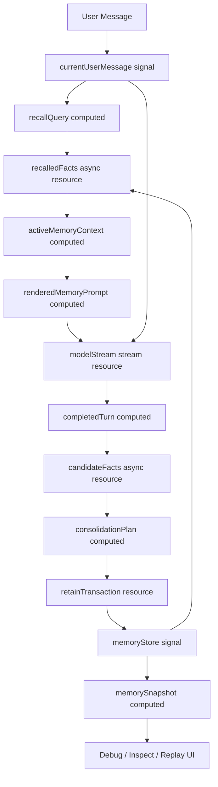

# RFC: AI Memory Correctness Example with signal-kernel

## 1. Document Status

**Status:** Draft
**Target:** Example / Proof of Concept
**Primary Goal:** Demonstrate how `signal-kernel` can model AI memory lifecycle correctness through a reactive graph.
**Non-goal:** Build a full agent framework, replace LangGraph, replace TanStack AI, or replace memory engines such as mem0 / Hindsight / Honcho.

---

## 2. Executive Summary

This RFC proposes an example project that demonstrates how `signal-kernel` can be used to model AI memory as a deterministic, observable, cancel-safe, transaction-safe, and snapshot-friendly runtime graph.

The example should not position `signal-kernel` as another AI agent framework. Instead, it should prove a narrower but stronger claim:

> AI memory is not just a storage or retrieval problem. It is a correctness-sensitive state lifecycle problem.

Most AI memory systems focus on memory engines, retrieval, extraction, or middleware integration. This example focuses on the lifecycle correctness around memory:

* Does the latest user turn always use the correct recalled memory?
* Can stale recall results be cancelled or ignored?
* Can rendered memory prompts avoid derived-state drift?
* Can memory retention be committed atomically?
* Can failed retention be rolled back?
* Can the memory lifecycle be inspected and snapshotted before durable replay exists?

The purpose of this example is to show that `signal-kernel` can act as a runtime layer between chat/agent frameworks and memory providers.

```txt
Chat / Agent Layer
  ↓
signal-kernel Memory Correctness Runtime
  ↓
Memory Driver / Store
```

This makes the example closer to the spirit of the planned nginx example: not replacing an existing infrastructure component, but re-modeling a lifecycle as a reactive runtime graph.

---

## 3. Motivation

AI memory pipelines usually follow a simple lifecycle:

```txt
before generation -> recall memory
 during generation -> inject memory into prompt / stream response
 after generation  -> extract and retain memory
```

This model is easy to integrate, but it hides several correctness problems:

1. **Stale recall race**
   A previous recall request may finish after a newer user turn and accidentally overwrite the active memory context.

2. **Derived prompt drift**
   Memory facts may change, but the rendered prompt fragment may still use outdated memory.

3. **Partial retention failure**
   Extracted memories may be partially written to storage, leaving the memory store in an inconsistent state.

4. **Invisible background side effects**
   Memory extraction and retention are often triggered in background tasks, making failures difficult to observe and reason about.

5. **Weak lifecycle snapshot semantics**
   Most memory systems can inspect current memory state, but they do not model memory lifecycle checkpoints as first-class runtime artifacts.

The example should demonstrate that these are not merely application bugs. They are runtime-level correctness problems.

---

## 4. Positioning

### 4.1 What This Example Is

This example is a **memory lifecycle correctness demo**.

It demonstrates how `signal-kernel` can model the following as a reactive graph:

* current user message
* recall query
* recalled facts
* rendered memory prompt
* model streaming state
* completed turn
* candidate memory facts
* consolidation plan
* retain transaction
* committed memory store
* memory snapshots

### 4.2 What This Example Is Not

This example is not:

* a LangGraph replacement
* a TanStack AI replacement
* a Vercel AI SDK replacement
* a mem0 replacement
* a vector database
* a full agent framework
* a production-ready memory provider
* a full RAG framework

### 4.3 Intended Market Position

The correct positioning is:

> `signal-kernel` is a reactive runtime for correctness-sensitive state lifecycles. In AI memory, it can model recall, prompt derivation, streaming, extraction, consolidation, and retention as a deterministic graph.

A concise positioning statement:

```txt
LangGraph models what the agent should do next.
Memory engines store and retrieve what the agent remembers.
signal-kernel ensures the memory lifecycle remains consistent, current, cancellable, observable, and recoverable.
```

---

## 5. Conceptual Architecture



The key architectural idea is that memory is not treated as a pair of `beforeGenerate()` and `afterGenerate()` hooks. Instead, the entire memory lifecycle is represented as a reactive graph.

---

## 6. Core Design Principles

### 6.1 Memory Prompt as Derived State

The rendered memory prompt should not be manually assembled and cached without dependency tracking.

It should be modeled as derived state:

```txt
recalled facts + current task + memory rendering policy
  -> rendered memory prompt
```

When the source memory facts change, the rendered prompt should become dirty automatically.

### 6.2 Recall as Source-Driven Async Resource

Memory recall should be driven by the current user turn.

When the user submits a new message, stale recall requests should be cancelled or ignored.

```txt
currentUserMessage changes
  -> recallQuery changes
  -> previous recall becomes stale
  -> new recall starts
  -> only latest recall can update active memory context
```

### 6.3 Extraction Is Not Memory

Extracted facts should not be treated as committed memory immediately.

They should be treated as candidate state transitions:

```txt
raw turn
  -> candidate facts
  -> validated facts
  -> consolidation plan
  -> committed memory
```

### 6.4 Retention as Transaction

Memory retention should not be a hidden background side effect.

It should be modeled as an explicit transaction:

```txt
candidate facts
  -> consolidation plan
  -> atomic retain transaction
  -> commit or rollback
```

If retention fails halfway, the runtime should avoid leaving the store in a partially updated state.

### 6.5 Snapshot as First-Class Runtime Artifact

Memory snapshots should not only be debug output.

The runtime should be able to produce lifecycle snapshots such as:

```txt
before recall
after recall
before generation
while streaming
after generation
after extraction
after consolidation
after retain commit
after retain rollback
```

This enables:

* inspection
* replay experiments in later phases
* rollback
* debugging
* deterministic demo scenarios

---

## 7. Example Scope

The first version should be intentionally small.

### 7.1 Included

The example should include:

* local in-memory memory store
* simple memory driver protocol
* mocked or local LLM stream
* fake memory extractor
* fake memory consolidator
* signal-kernel graph wiring
* visual inspector panel
* race condition demo
* derived prompt drift demo
* partial retain failure demo
* snapshot timeline inspection demo

### 7.2 Excluded

The first version should not include:

* real vector database
* real embeddings
* real multi-agent orchestration
* real LangGraph integration
* real TanStack AI integration
* real mem0 / Hindsight / Honcho integration
* authentication
* production persistence
* cloud deployment
* full snapshot replay semantics
* the final `@signal-kernel/snapshot` package format
* a published `@signal-kernel/memory-runtime` package

These can be future phases after the correctness model is proven.

### 7.3 V1 Implementation Boundary

V1 should prove a small correctness model, not a full AI runtime.

V1 must prove:

* latest recall wins when recall requests resolve out of order
* the rendered memory prompt is derived from the current recalled facts
* extracted candidate facts are not committed memory facts
* retention is modeled as commit / rollback, not a hidden background write
* snapshots are local runtime inspection artifacts

V1 should not promise:

* durable replay
* resumable generation
* provider-specific memory middleware
* a stable memory-runtime package API
* a stable snapshot serialization format

---

## 8. Proposed Project Structure

```txt
examples/ai-memory-correctness/
  package.json
  tsconfig.json
  vite.config.ts
  index.html
  src/
    app/
      App.tsx
      components/
        ChatPanel.tsx
        MemoryPanel.tsx
        TimelinePanel.tsx
        ScenarioControls.tsx
        GraphInspector.tsx
      styles.css

    memory/
      createMemoryRuntime.ts
      memoryDriver.ts
      localMemoryDriver.ts
      types.ts
      renderMemoryPrompt.ts
      extractCandidateFacts.ts
      consolidateFacts.ts
      retainTransaction.ts
      snapshot.ts

    model/
      mockModelStream.ts
      types.ts

    scenarios/
      staleRecallRace.ts
      derivedPromptDrift.ts
      partialRetainFailure.ts
      snapshotTimeline.ts

    kernel/
      createChatGraph.ts
      createMemoryGraph.ts
```

This should live under `examples/` first, not as a published package.

Only after the example proves a stable abstraction should it be considered for extraction into:

```txt
packages/memory-runtime
```

---

## 9. Memory Driver Protocol

The memory driver should be intentionally minimal.

```ts
export type MemoryScope = {
  userId: string
  threadId: string
}

export type MemoryFact = {
  id: string
  content: string
  status: 'active' | 'superseded' | 'deleted'
  confidence: number
  createdAt: number
  updatedAt: number
  supersedes?: string[]
}

export type RecallInput = {
  scope: MemoryScope
  query: string
  signal?: AbortSignal
}

export type RecallResult = {
  facts: MemoryFact[]
}

export type CandidateFact = {
  id: string
  content: string
  confidence: number
  sourceTurnId: string
  status: 'candidate' | 'validated' | 'rejected'
}

export type ConsolidationAction =
  | {
      type: 'insert'
      fact: CandidateFact
    }
  | {
      type: 'merge'
      targetFactId: string
      fact: CandidateFact
    }
  | {
      type: 'supersede'
      targetFactId: string
      fact: CandidateFact
    }
  | {
      type: 'skip'
      reason: string
      fact: CandidateFact
    }

export type ConsolidationPlan = {
  actions: ConsolidationAction[]
}

export type MemorySnapshot = {
  scope: MemoryScope
  facts: MemoryFact[]
  version: number
  createdAt: number
}

export interface MemoryDriver {
  recall(input: RecallInput): Promise<RecallResult>
  inspect(scope: MemoryScope): Promise<MemorySnapshot>
  applyPlan(scope: MemoryScope, plan: ConsolidationPlan): Promise<MemorySnapshot>
}
```

The driver protocol should avoid becoming too smart. The correctness layer should live in the signal-kernel runtime, not inside the storage driver.

The local driver may implement `applyPlan()` by mutating an in-memory map. That does not make the driver responsible for lifecycle correctness. The runtime layer should still model the retain operation as an explicit commit / rollback transition.

---

## 10. Memory Runtime API Sketch

The example can expose a local helper called `createMemoryRuntime`.

```ts
export type CreateMemoryRuntimeOptions = {
  scope: () => MemoryScope
  driver: MemoryDriver
  extract: (input: ExtractInput) => Promise<CandidateFact[]>
  consolidate: (input: ConsolidateInput) => Promise<ConsolidationPlan>
  render: (facts: MemoryFact[]) => string
}

export function createMemoryRuntime(options: CreateMemoryRuntimeOptions) {
  // signal-kernel graph lives here
}
```

This helper should follow the existing `signal-kernel` public API style:

* `signal()` and `computed()` return objects with `.get()` / `.peek()` methods.
* `createResource()` returns `[valueGetter, meta]`.
* `createStreamResource()` returns `[valueGetter, meta]`.
* React integration should happen only through adapter hooks such as `useKernelValue`, `useResource`, and `useStreamResource`.

Recall should be modeled with the actual `createResource()` tuple shape:

```ts
const recallQuery = computed(() => currentUserMessage.get().trim())

const recalledFacts = createResource(
  () => ({
    scope: options.scope(),
    query: recallQuery.get(),
  }),
  async ({ scope, query }, ctx) => {
    const result = await options.driver.recall({
      scope,
      query,
      signal: ctx.signal,
    })

    return result.facts
  },
)
```

Possible returned API shape:

```ts
const memory = createMemoryRuntime({
  scope,
  driver,
  extract,
  consolidate,
  render,
})

const context = memory.createContext({
  input: currentUserMessage.get,
})

const [recalledFacts, recallMeta] = context.recalledFacts

recalledFacts()
recallMeta.status()
context.renderedPrompt.get()
context.status.get()
context.error.get()
context.snapshot.get()

memory.actions.retainTurn({
  userMessage,
  assistantMessage,
})
```

The API should demonstrate the conceptual model without over-engineering the final package shape. It should not introduce a second callable-signal style that differs from the current `@signal-kernel/core` API.

---

## 11. Chat Graph Sketch

```ts
const currentUserMessage = signal('')
const currentThreadId = signal('thread_1')
const currentUserId = signal('user_1')

const memory = createMemoryRuntime({
  scope: () => ({
    userId: currentUserId.get(),
    threadId: currentThreadId.get(),
  }),
  driver: localMemoryDriver(),
  extract: extractCandidateFacts,
  consolidate: consolidateFacts,
  render: renderMemoryPrompt,
})

const memoryContext = memory.createContext({
  input: currentUserMessage.get,
})

const modelStream = createStreamResource<
  { message: string; memoryPrompt: string },
  string,
  string,
  Error
>(
  () => ({
    message: currentUserMessage.get(),
    memoryPrompt: memoryContext.renderedPrompt.get(),
  }),
  async ({ message, memoryPrompt }, ctx) => {
    let content = ''

    for await (const chunk of mockModelStream({ system: memoryPrompt, user: message })) {
      if (ctx.isCancelled()) return

      content += chunk
      ctx.emit(chunk)
    }

    ctx.done(content)
  },
  {
    initialValue: '',
    reduce: (current, chunk) => `${current ?? ''}${chunk}`,
    onCancel: 'keep-partial',
    onError: 'keep-partial',
    onSuccess: (assistantMessage) => {
      memory.actions.retainTurn({
        userMessage: currentUserMessage.peek(),
        assistantMessage,
      })
    },
  }
)

const [assistantText, streamMeta] = modelStream

assistantText()
streamMeta.status()
```

Important: this is not the final API contract. It is an implementation sketch to guide the example.

Retention should be triggered by an explicit turn lifecycle transition, such as the `onSuccess` callback shown above, or by a dedicated graph action. It should not depend on React component lifecycle.

---

## 12. Demo Scenarios

The example should contain four demo scenarios.

---

### 12.1 Scenario A: Stale Recall Race

#### Problem

A user submits message A. Recall A starts.

Before Recall A finishes, the user submits message B. Recall B starts.

Recall B finishes first, then Recall A finishes later.

In a naive implementation, Recall A may overwrite the memory context for message B.

#### Naive Behavior

```txt
Turn A starts recall
Turn B starts recall
Turn B recall finishes -> active memory = B
Turn A recall finishes -> active memory = A  [stale overwrite]
```

#### Expected signal-kernel Behavior

```txt
Turn A starts recall
Turn B starts recall
Turn A recall becomes stale
Turn B recall finishes -> active memory = B
Turn A finishes later -> ignored or cancelled
```

#### What the UI Should Show

* two quickly submitted messages
* both recall operations in timeline
* stale recall marked as cancelled / ignored
* active memory context remains tied to the latest turn

#### signal-kernel Feature Demonstrated

* source-driven async resource
* cancellation
* last-write-wins
* consistent status/value/error

---

### 12.2 Scenario B: Derived Prompt Drift

#### Problem

The memory store changes, but the rendered memory prompt does not update.

#### Naive Behavior

```txt
facts = [old preference]
prompt = render(facts)

facts updated
prompt still contains old preference
```

#### Expected signal-kernel Behavior

```txt
memoryStore changes
  -> recalledFacts dirty
  -> activeMemoryContext dirty
  -> renderedMemoryPrompt dirty
  -> prompt updates automatically
```

#### What the UI Should Show

* memory facts panel
* rendered prompt panel
* manual update to memory fact
* prompt automatically updates
* graph inspector shows dependency path

#### signal-kernel Feature Demonstrated

* computed derived state
* dependency tracking
* prevention of derived-state drift

---

### 12.3 Scenario C: Partial Retain Failure

#### Problem

The system extracts multiple candidate facts after a completed turn.

During retention, one write fails.

A naive implementation may leave the memory store partially updated.

#### Naive Behavior

```txt
candidate facts = [fact1, fact2, fact3]
write fact1 success
write fact2 fails
fact1 remains committed [partial memory state]
```

#### Expected signal-kernel Behavior

```txt
candidate facts = [fact1, fact2, fact3]
build consolidation plan
start retain transaction
write fact1 staged
write fact2 fails
rollback staged changes
memory store unchanged
```

#### What the UI Should Show

* extracted candidate facts
* consolidation plan
* retain transaction begins
* failure injected at configurable step
* rollback event
* final memory state unchanged

#### signal-kernel Feature Demonstrated

* atomic transaction semantics
* rollback
* explicit lifecycle state
* failure visibility

---

### 12.4 Scenario D: Snapshot Timeline Inspection

#### Problem

Most memory systems can inspect current state, but cannot easily explain how memory reached that state.

#### Expected signal-kernel Behavior

The runtime records memory lifecycle snapshots:

```txt
before recall
after recall
before stream
while streaming
after stream
after extraction
after consolidation
after retain commit / rollback
```

#### What the UI Should Show

* timeline of snapshots
* selected snapshot detail
* memory facts at that point
* active prompt at that point
* stream status at that point
* retain transaction status at that point
* no durable replay behavior required in v1

#### signal-kernel Feature Demonstrated

* snapshot as runtime artifact
* future replay-friendly state model
* observability
* deterministic debugging

---

## 13. UI Requirements

The UI should be simple but explanatory.

### 13.1 Chat Panel

Shows:

* user input
* assistant stream
* submit button
* scenario selector
* abort / reset button

### 13.2 Memory Panel

Shows:

* active memory facts
* recalled facts
* candidate facts
* committed facts
* superseded facts

### 13.3 Prompt Panel

Shows:

* rendered memory prompt
* whether prompt is fresh or stale
* dependency source of the prompt

### 13.4 Timeline Panel

Shows lifecycle events:

```txt
turn.created
recall.started
recall.cancelled
recall.resolved
prompt.rendered
stream.started
stream.chunk
stream.completed
extract.started
extract.resolved
consolidation.planned
retain.started
retain.committed
retain.rolled_back
snapshot.created
```

### 13.5 Graph Inspector

Shows a simplified graph:

```txt
currentUserMessage
  -> recallQuery
  -> recalledFacts
  -> renderedMemoryPrompt
  -> modelStream
  -> completedTurn
  -> candidateFacts
  -> consolidationPlan
  -> retainTransaction
  -> memoryStore
```

The graph does not need to be fully interactive in v1. It only needs to make the dependency model visible.

---

## 14. Runtime Event Types

The example should define structured runtime events.

```ts
export type MemoryRuntimeEvent =
  | {
      type: 'turn.created'
      turnId: string
      message: string
      timestamp: number
    }
  | {
      type: 'recall.started'
      turnId: string
      query: string
      timestamp: number
    }
  | {
      type: 'recall.cancelled'
      turnId: string
      reason: string
      timestamp: number
    }
  | {
      type: 'recall.resolved'
      turnId: string
      factIds: string[]
      timestamp: number
    }
  | {
      type: 'prompt.rendered'
      turnId: string
      prompt: string
      timestamp: number
    }
  | {
      type: 'stream.started'
      turnId: string
      timestamp: number
    }
  | {
      type: 'stream.chunk'
      turnId: string
      chunk: string
      value: string
      timestamp: number
    }
  | {
      type: 'stream.completed'
      turnId: string
      value: string
      timestamp: number
    }
  | {
      type: 'extract.started'
      turnId: string
      timestamp: number
    }
  | {
      type: 'extract.resolved'
      turnId: string
      candidates: CandidateFact[]
      timestamp: number
    }
  | {
      type: 'consolidation.planned'
      turnId: string
      plan: ConsolidationPlan
      timestamp: number
    }
  | {
      type: 'retain.started'
      turnId: string
      plan: ConsolidationPlan
      timestamp: number
    }
  | {
      type: 'retain.committed'
      turnId: string
      snapshot: MemorySnapshot
      timestamp: number
    }
  | {
      type: 'retain.rolled_back'
      turnId: string
      error: string
      timestamp: number
    }
  | {
      type: 'snapshot.created'
      label: string
      snapshot: MemorySnapshot
      timestamp: number
    }
```

These events should power the timeline panel and make the demo easy to understand.

---

## 15. State Model

### 15.1 Turn State

```ts
export type TurnStatus =
  | 'idle'
  | 'recalling'
  | 'generating'
  | 'extracting'
  | 'consolidating'
  | 'retaining'
  | 'completed'
  | 'failed'
  | 'cancelled'

export type TurnState = {
  id: string
  status: TurnStatus
  userMessage: string
  assistantMessage?: string
  recalledFactIds: string[]
  candidateFacts: CandidateFact[]
  consolidationPlan?: ConsolidationPlan
  error?: string
  createdAt: number
  updatedAt: number
}
```

### 15.2 Fact State

```ts
export type FactStatus = 'active' | 'superseded' | 'deleted'

export type MemoryFact = {
  id: string
  content: string
  status: FactStatus
  confidence: number
  createdAt: number
  updatedAt: number
  supersedes?: string[]
  sourceTurnIds?: string[]
}
```

### 15.3 Candidate Fact State

```ts
export type CandidateFact = {
  id: string
  content: string
  confidence: number
  sourceTurnId: string
  status: 'candidate' | 'validated' | 'rejected'
}
```

The important conceptual separation:

```txt
CandidateFact is not MemoryFact.
CandidateFact is only a proposed mutation.
MemoryFact is committed runtime state.
```

---

## 16. Local Memory Driver Behavior

The local memory driver can use a simple in-memory map.

```ts
const factsByScope = new Map<string, MemoryFact[]>()
```

### 16.1 Recall

For v1, recall can be simple keyword matching.

```txt
query: "DEV.to article"
matched facts:
- User publishes technical articles on DEV.to.
- User prefers precise technical explanations.
```

No embeddings are required.

### 16.2 Inspect

Returns current facts for the scope.

### 16.3 Apply Plan

Applies consolidation actions.

For the partial failure scenario, the driver should support failure injection:

```ts
localMemoryDriver({
  failOnActionIndex: 1,
})
```

This allows the demo to show rollback behavior.

---

## 17. Mock Model Stream

The example should not depend on a real model provider.

Use a mock stream:

```ts
export async function* mockModelStream(input: {
  system: string
  user: string
}) {
  const chunks = [
    'I understand your context. ',
    'Based on your memory profile, ',
    'here is a response...'
  ]

  for (const chunk of chunks) {
    await delay(300)
    yield chunk
  }
}
```

The mock stream should expose enough behavior to demonstrate:

* streaming
* cancellation through `createStreamResource` and `ctx.isCancelled()`
* completed turn
* retention trigger

---

## 18. Fake Extraction and Consolidation

### 18.1 Extraction

The extraction function can be deterministic.

Example:

```ts
export async function extractCandidateFacts(input: ExtractInput) {
  if (input.userMessage.includes('DEV.to')) {
    return [
      {
        id: createId(),
        content: 'User is interested in publishing technical articles on DEV.to.',
        confidence: 0.9,
        sourceTurnId: input.turnId,
        status: 'candidate',
      },
    ]
  }

  return []
}
```

### 18.2 Consolidation

The consolidation function can use simple rules:

```txt
if similar fact exists -> merge
if contradicts existing fact -> supersede
if low confidence -> skip
otherwise -> insert
```

No LLM-based consolidation is needed in v1.

---

## 19. Transaction Model

The retain transaction should support staging and rollback.

Conceptually:

```ts
async function retainTransaction(input: {
  scope: MemoryScope
  plan: ConsolidationPlan
  driver: MemoryDriver
}) {
  const before = await driver.inspect(input.scope)

  try {
    const after = await driver.applyPlan(input.scope, input.plan)
    return {
      status: 'committed',
      before,
      after,
    }
  } catch (error) {
    await restoreSnapshot(input.scope, before)

    return {
      status: 'rolled_back',
      before,
      error,
    }
  }
}
```

For v1, rollback can be implemented by restoring the previous in-memory snapshot.

Production drivers may eventually provide native transactions. Even then, the signal-kernel runtime should still expose retain status, errors, commit events, and rollback events as graph state. The driver can own persistence mechanics; the runtime owns lifecycle visibility.

The point is not to build a database-grade transaction system. The point is to demonstrate the runtime semantics:

```txt
memory retention is not a background side effect;
it is an explicit state transition with commit / rollback semantics.
```

---

## 20. Snapshot Model

V1 snapshots are local runtime inspection artifacts.

They should help a viewer answer:

```txt
What did the memory graph know at this lifecycle point?
Which prompt was rendered from those facts?
Which stream or retain status was active?
Which events had already happened?
```

V1 snapshots should not define the final `@signal-kernel/snapshot` package format, durable replay protocol, or cross-runtime serialization boundary.

Snapshots should record:

```ts
export type RuntimeSnapshot = {
  id: string
  label: string
  turnId?: string
  memory: MemorySnapshot
  renderedPrompt?: string
  streamStatus?: string
  retainStatus?: string
  events: MemoryRuntimeEvent[]
  createdAt: number
}
```

Example labels:

```txt
before-recall
after-recall
before-stream
after-stream
after-extraction
after-consolidation
after-retain-commit
after-retain-rollback
```

The UI should allow selecting a snapshot from the timeline and inspecting its state.

---

## 21. Implementation Phases

### Phase 1: Static Demo Shell

* Create Vite app
* Add chat panel
* Add memory panel
* Add timeline panel
* Add mock data
* No real signal-kernel wiring yet

Goal: define the visual explanation.

### Phase 2: Local Memory Driver

* Implement `MemoryDriver`
* Implement in-memory fact store
* Implement recall / inspect / applyPlan
* Add failure injection

Goal: make memory state observable.

### Phase 3: signal-kernel Memory Graph

* Add `currentUserMessage` signal
* Add `recallQuery` computed
* Add `recalledFacts` async resource
* Add `renderedMemoryPrompt` computed
* Add memory context API

Goal: prove recall and prompt derivation correctness.

### Phase 4: Mock Streaming

* Add mock model stream
* Connect rendered prompt to stream input
* Add stream status to UI
* Add cancellation behavior

Goal: show memory prompt participating in generation lifecycle.

### Phase 5: Extraction and Retention

* Add deterministic extractor
* Add deterministic consolidator
* Add retain transaction
* Add rollback demo

Goal: prove memory retention as explicit transaction.

### Phase 6: Snapshot Timeline

* Add runtime snapshot model
* Record snapshots across lifecycle
* Add snapshot inspector
* Add selected snapshot detail view
* Do not define durable replay semantics in v1

Goal: prove memory lifecycle observability without locking in the future snapshot package design.

---

## 22. Testing Strategy

The example should include unit tests for correctness scenarios.

### 22.1 Stale Recall Race Test

Expected behavior:

```txt
When recall A resolves after recall B,
active recalled facts must still belong to B.
```

### 22.2 Derived Prompt Drift Test

Expected behavior:

```txt
When memory facts change,
rendered prompt recomputes automatically.
```

### 22.3 Partial Retain Failure Test

Expected behavior:

```txt
When retain fails halfway,
committed memory store is restored to previous snapshot.
```

### 22.4 Snapshot Inspection Test

Expected behavior:

```txt
Each major lifecycle stage emits a snapshot with consistent memory state.
The snapshot can be inspected without requiring durable replay.
```

---

## 23. Success Criteria

The example is successful if a viewer can understand these claims without reading the source code deeply:

1. AI memory can suffer from stale async recall.
2. AI memory prompt rendering can suffer from derived-state drift.
3. AI memory retention can suffer from partial commit bugs.
4. `signal-kernel` can model these problems as runtime graph correctness problems.
5. The runtime graph makes memory lifecycle inspectable and snapshot-friendly.
6. This is not a LangGraph replacement or memory engine replacement.
7. This is a correctness layer that can sit between chat/agent frameworks and memory providers.
8. The example follows the current `signal-kernel` API shape: `.get()` / `.peek()` for graph values and tuple return values for async resources.

---

## 24. Future Extensions

After v1, possible extensions include:

### 24.1 TanStack AI Integration

Expose the memory runtime as middleware:

```txt
before generate -> use renderedMemoryPrompt
 after generate -> retainTurn
```

But internally, the lifecycle remains graph-driven.

### 24.2 Vercel AI SDK Integration

Provide adapter utilities for streaming chat apps.

### 24.3 External Memory Driver Adapters

Possible adapters:

* mem0 driver
* Hindsight driver
* Honcho driver
* SQLite driver
* Postgres driver
* vector store driver

These should remain storage/retrieval providers. They should not own the runtime correctness model.

### 24.4 Real LLM Extraction

Replace deterministic extraction with LLM-based extraction.

Important: even with real LLM extraction, candidate facts should still be treated as proposed mutations, not committed memory.

### 24.5 Snapshot Package Integration

When `@signal-kernel/snapshot` exists, this example can become one of its strongest demos.

Potential flow:

```txt
memory graph -> snapshot -> restore -> replay turn -> compare output
```

### 24.6 Runtime DevTools

The memory graph can become an ideal use case for future signal-kernel devtools.

---

## 25. Key Narrative for Documentation

The example documentation should emphasize this narrative:

```txt
Most AI memory examples show how to store and retrieve memories.
This example shows what can go wrong between retrieval and retention.
```

Then explain:

```txt
Memory recall is async.
Prompt rendering is derived state.
Memory extraction produces dirty candidate facts.
Memory consolidation is a state transition.
Memory retention needs commit / rollback semantics.
Memory debugging needs lifecycle snapshots first; replay can be explored after the snapshot boundary is clearer.
```

Final message:

```txt
AI memory is not only a memory engine problem.
It is a runtime correctness problem.
```

---

## 26. Recommended README Opening

```md
# AI Memory Correctness Demo

This example demonstrates how signal-kernel can model AI memory as a reactive runtime graph.

It does not try to replace LangGraph, TanStack AI, Vercel AI SDK, mem0, Hindsight, or Honcho.

Instead, it focuses on a lower-level problem:

> How do we keep AI memory recall, prompt derivation, streaming, extraction, consolidation, and retention correct under async updates?

The demo shows four common failure modes:

1. stale recall race
2. derived prompt drift
3. partial retain failure
4. missing memory lifecycle snapshots

Then it shows how signal-kernel can model these as deterministic graph problems.
```

---

## 27. Final Recommendation

Start this as an example, not a package.

Recommended first location:

```txt
examples/ai-memory-correctness
```

Recommended first public title:

```txt
AI Memory Correctness with signal-kernel
```

Recommended technical claim:

```txt
signal-kernel does not replace memory engines or agent frameworks.
It provides a runtime graph for correctness-sensitive AI memory lifecycles.
```

Recommended implementation focus:

```txt
Do not build a full AI runtime yet.
Build the smallest example that proves the correctness advantage.
```
