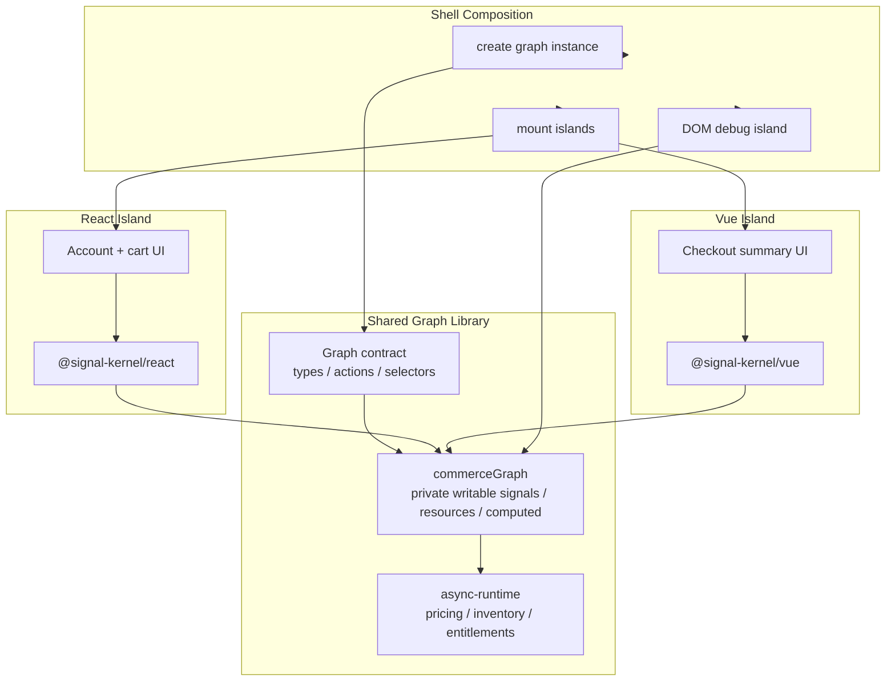
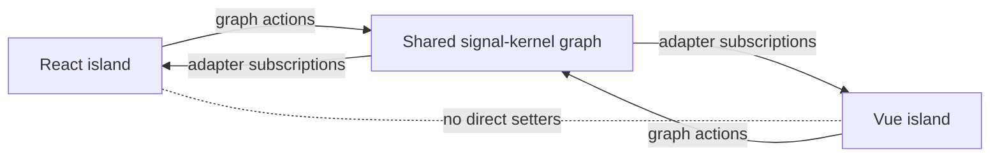
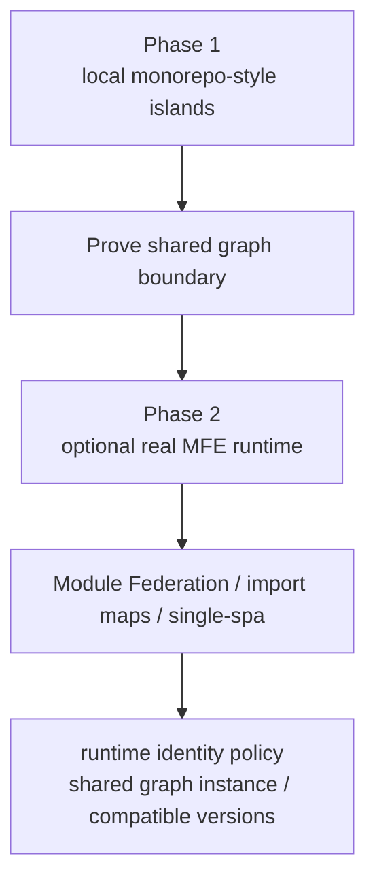

# RFC: Micro Frontend Example

Status: proposed

## Problem Statement

`signal-kernel` now has a framework-neutral core, async runtime, React adapter, and Vue adapter.

The next frontend-oriented example should demonstrate that these packages are not just separate framework integrations. They can cooperate around one shared runtime graph.

Micro frontend applications often split UI into independently owned islands. Those islands may use different frameworks, different bundles, or different release cadences. The hard part is not only rendering each island. The hard part is deciding where shared business state, async correctness, derived decisions, and cross-island coordination should live.

This RFC intentionally starts with a monorepo-style shared library boundary, similar to how Nx or Turborepo applications share domain libraries across apps.

The first version should not depend on Module Federation, single-spa, import maps, or a production micro frontend runtime. Those tools solve remote loading and deployment composition. This example should first prove the lower-level runtime boundary:

> shared graph library -> independently mounted islands -> no framework-to-framework state coupling

This example should prove the architectural claim:

> UI islands can be independently rendered, while shared business state lives in a framework-agnostic graph.

React and Vue should not synchronize with each other directly. They should both consume and update the same `signal-kernel` graph.

---

## Design Principles

### 1. Define a Graph Contract

The shared graph must expose an explicit contract:

* selectors
* resources
* actions

Raw writable signals should remain private to the graph implementation.

Islands should not receive arbitrary writable signal access. They should read through selectors/resources and write through actions.

This keeps ownership clear:

```txt
shared graph owns state mutation
islands request state changes through actions
adapters expose readable graph state to frameworks
```

### 2. Use Shell Dependency Injection in Phase 1

Phase 1 should use shell dependency injection as the primary implementation model.

The shell creates the graph instance and passes the graph contract to each island during mount.

The first implementation should not use a shared singleton as the main pattern. A singleton may be useful for tiny demos, but it hides the runtime ownership problem that micro frontend shells need to solve.

### 3. Document Runtime Identity Requirements

Production micro frontends must ensure that all islands agree on a compatible runtime identity:

* the same graph instance, when state is meant to be shared live
* compatible `@signal-kernel/core` and adapter versions
* compatible graph contract versions
* compatible restore/snapshot versions if snapshot is introduced later

If two islands accidentally load separate graph instances, they will not share state even if they import the same source code.

If two islands load incompatible `signal-kernel` runtime versions, dependency tracking and adapter behavior may not be safe to assume.

This example should call out that local Vite imports are only a phase 1 approximation. Real MFE runtime identity must be handled by the shell, shared dependency policy, module federation shared config, import map policy, or another production composition mechanism.

---

## Goals

* Demonstrate a single shared graph consumed by multiple frontend islands.
* Mount at least one React island and one Vue island on the same page.
* Keep business state and async correctness outside React and Vue component trees.
* Show cross-island updates without direct React-to-Vue or Vue-to-React coupling.
* Show async resource behavior that remains latest-wins across islands.
* Make the example practical enough to resemble a real micro frontend shell.
* Expose future snapshot questions around shell initialization and late-mounted islands.

---

## Non-Goals

* Building a production micro frontend platform.
* Teaching Webpack Module Federation, import maps, single-spa, or deployment topology.
* Implementing independent build pipelines for each island.
* Implementing remote runtime loading.
* Implementing server-side rendering or hydration.
* Implementing snapshot capture or restore in this RFC.
* Turning `signal-kernel` into a UI framework or shell framework.
* Making React, Vue, or the shell own graph semantics.

---

## Core Scenario

The example should model a small commerce or account shell with independent UI islands.

Suggested domain:

```txt
Shell
  owns graph creation and page layout

React island
  account selector
  cart editor

Vue island
  checkout summary
  entitlement or inventory status

Plain DOM island
  graph event log / debug view
```

Shared graph state should include:

* selected account
* selected region
* cart items
* feature flags or entitlements
* pricing resource
* inventory resource
* checkout eligibility
* event log

The example should make it obvious that changing state in one island updates other islands through the graph.

---

## Positioning

This is not a micro frontend framework.

The example should not imply that `signal-kernel` owns routing, remote loading, deployment, CSS isolation, sandboxing, or module federation.

The first implementation should model a local monorepo-style micro frontend boundary:

```txt
shared graph library
  keeps writable signals private
  exports selectors, resources, and actions

React island
  receives graph contract from shell
  renders with @signal-kernel/react

Vue island
  receives graph contract from shell
  renders with @signal-kernel/vue

Shell
  creates graph instance
  composes islands
  does not own business state
```

In a real Nx or Turborepo setup, the shared graph could live in a workspace library consumed by multiple framework apps. The local example should make that boundary explicit even if everything is built by one Vite app.

The intended mental model is:

```txt
shell creates graph
-> islands receive graph access
-> React/Vue adapters render graph state
-> async-runtime owns async correctness
-> shell or debug island may observe graph events
```

`signal-kernel` is the shared state and decision runtime. It is not the micro frontend host.

---

## Architecture

The example should make the shared graph library boundary visible.



The key rule is that React and Vue do not talk to each other.



Future production MFE integration can replace local imports with remote loading, but the graph boundary should remain the same.



---

## Proposed Example Layout

```txt
examples/
  micro-frontend-runtime/
    README.md
    package.json
    vite.config.ts
    src/
      shared-graph/
        commerceGraph.ts
        commerceGraph.test.ts
        graphContract.ts
        fakeInventoryApi.ts
        fakePricingApi.ts
        fixtures.ts
        types.ts
      react-island/
        AccountCartIsland.tsx
      vue-island/
        CheckoutSummaryIsland.ts
      shell/
        mountShell.ts
      eventLog.ts
      main.tsx
```

The exact structure can change during implementation, but graph code must remain independent from React, Vue, and DOM.

The first implementation can use a single Vite application, but the folder structure should communicate a shared library boundary rather than a single mixed framework app.

In documentation, `src/shared-graph/` should be described as the part that would become a workspace library in a real Nx/Turborepo setup.

---

## Graph Design

The graph should be created once by the shell and consumed by islands through an explicit graph contract.

The implementation should distinguish private graph internals from public island-facing APIs.

Suggested contract shape:

```ts
interface CommerceGraphContract {
  selectors: {
    selectedAccount: Readable<AccountId>;
    selectedRegion: Readable<Region>;
    cartItems: Readable<CartItem[]>;
    checkout: Readable<CheckoutDecision>;
  };
  resources: {
    pricing: ResourceTuple<PricingResult>;
    inventory: ResourceTuple<InventoryResult>;
  };
  actions: {
    selectAccount(accountId: AccountId): void;
    selectRegion(region: Region): void;
    addItem(itemId: ItemId): void;
    removeItem(itemId: ItemId): void;
    changeQuantity(itemId: ItemId, quantity: number): void;
    clearCart(): void;
  };
}
```

Raw writable signals should not be part of this contract.

### Signals

Signals should represent source-of-truth UI and business inputs:

```ts
const selectedAccount = signal<AccountId>("account-a");
const selectedRegion = signal<Region>("us-east");
const cartItems = signal<CartItem[]>([]);
const eventLog = signal<ShellEvent[]>([]);
```

Examples:

* selected account
* selected region
* cart items
* active promotion code
* feature flag overrides
* shell event log

### Async Resources

Resources should represent async business state:

```ts
const pricing = createResource(
  () => ({ accountId: selectedAccount.get(), region: selectedRegion.get(), items: cartItems.get() }),
  (request, ctx) => fakePricingApi(request, ctx),
);
```

Examples:

* pricing
* inventory
* account entitlements
* promotion validation

If an island rapidly changes account, region, or cart items, stale async results must not overwrite newer state.

### Computed Values

Computed values should derive cross-island decisions:

* cart total
* unavailable items
* checkout eligibility
* checkout blocked reason
* visible feature flags
* selected account display name

Computed values should be recomputed from graph inputs rather than stored separately.

### Actions

Graph actions should provide island-safe write entrypoints:

* select account
* select region
* add item
* remove item
* change quantity
* clear cart

Actions should update graph signals and append shell events. They should not call React or Vue APIs.

---

## Island Boundaries

### Shell

The shell should:

* create the graph
* mount islands
* pass the graph contract to islands
* avoid owning business rules
* optionally render a plain DOM debug/event-log island

The phase 1 implementation should use dependency injection from the shell. Islands should not import a graph singleton as their primary access pattern.

In a production micro frontend, graph access might come from shell-provided context, dependency injection, a shared runtime package, import maps, or module federation shared configuration.

### React Island

The React island should:

* read graph state through `@signal-kernel/react`
* call graph actions from event handlers
* avoid syncing to Vue directly
* avoid implementing pricing or inventory correctness in React state

Suggested responsibilities:

* account selector
* region selector
* cart editor

### Vue Island

The Vue island should:

* read graph state through `@signal-kernel/vue`
* call graph actions from event handlers if needed
* avoid syncing to React directly
* avoid implementing checkout eligibility in Vue refs

Suggested responsibilities:

* checkout summary
* pricing and inventory status
* checkout gate display

### Debug Island

A plain DOM debug island can render:

* event log
* active account
* resource status transitions
* ignored stale results

The debug island exists to make cross-island graph behavior visible.

---

## Expected Behavior

### Cross-Island State Sharing

If the React island changes the selected account, the Vue island should update its summary through the graph.

If the React island updates cart quantities, the Vue island should reflect pricing, inventory, and checkout eligibility through graph-derived state.

No React component should call a Vue method. No Vue component should call a React setter.

No island should mutate raw writable signals directly.

### Async Correctness

If the user rapidly changes region or cart contents, older pricing or inventory results must not become authoritative.

The event log should show stale results being ignored or cancelled.

### Checkout Gate

Checkout should only be allowed when:

* the cart has at least one item
* pricing is available for the current account and region
* inventory is available for all cart items
* account entitlements allow checkout

If checkout is blocked, a computed `blockedReason` should explain why.

---

## Snapshot Discovery Questions

This RFC does not implement snapshot support, but the example should expose snapshot questions specific to micro frontends.

Future snapshot work should answer:

* Can the shell initialize islands from a graph snapshot?
* What happens when an island mounts after the graph already has state?
* Should cart state be captured as source state?
* Should pricing and inventory values be restored or refetched?
* Should computed checkout eligibility be serialized or recomputed?
* How should stale async resource metadata behave after restore?
* Can multiple independently loaded islands agree on the same restored graph version?
* Should snapshot payloads include island metadata, or only graph state?
* How should snapshot restore verify graph contract and runtime version compatibility?

The example should help separate graph snapshot concerns from micro frontend shell concerns.

---

## Testing Strategy

Tests should prioritize graph behavior over UI implementation details.

Required graph-level tests:

* React-like cart actions update graph state consumed by all islands
* account or region changes invalidate pricing and inventory resources
* stale pricing results do not overwrite the latest request
* checkout eligibility requires pricing, inventory, cart contents, and entitlements
* computed checkout state can be tested without mounting React or Vue
* graph actions are the only public write path exposed to islands

Framework-level checks should be lighter:

* the example typechecks
* the example builds with React and Vue islands mounted on the same page
* React island receives its graph contract from the shell and reads graph state through the React adapter
* Vue island receives its graph contract from the shell and reads graph state through the Vue adapter
* neither island owns cross-island business rules

Tests should not inspect private async-runtime tokens or internal graph structures.

---

## Documentation Requirements

The example README should explain:

* why micro frontends need a shared state boundary
* why the graph belongs outside React and Vue
* why writable signals are private graph internals
* how islands communicate through graph actions and subscriptions
* how async-runtime preserves latest-wins behavior across islands
* why this is not a module federation or shell framework example
* why production MFE deployments must manage graph instance and runtime version identity
* which snapshot questions the example reveals

The README should avoid describing `signal-kernel` as a micro frontend framework.

---

## Open Questions

### Should the first version use a singleton graph or explicit dependency injection?

Decision: use explicit dependency injection from the shell.

A singleton graph is easier for tiny local examples, but it hides runtime ownership and makes the micro frontend boundary less explicit.

The shell should create the graph and pass the graph contract to islands during mount.

### Should the example include a plain DOM island?

A plain DOM island can make the graph boundary more obvious because it proves the graph is not React/Vue-specific.

It is useful if it remains a small debug/event-log view.

### Should this example use real module federation?

Not initially.

Real module federation would distract from the runtime boundary this example is trying to prove. It would also risk making the example look like a bundler or deployment demonstration instead of a shared graph demonstration.

The first version should model island boundaries through a local monorepo-style shared graph library.

Real MFE tooling can be a follow-up phase after the shared graph boundary is clear.

---

## Decision

Build a micro frontend example around a commerce-style shared graph.

Use one shell page with independently mounted React, Vue, and optional plain DOM islands.

Do not use Module Federation or another MFE runtime in phase 1. Instead, model the shared graph as a workspace-style library boundary, similar to Nx or Turborepo shared libraries.

Use shell dependency injection as the graph access model.

Expose selectors, resources, and actions as the graph contract. Keep raw writable signals private.

Keep shared business state, async resources, and checkout decisions inside the framework-neutral graph.

Use adapters only to expose graph state to each framework.

Document that production MFE deployments must guarantee the same graph instance or compatible runtime/contract identity when state is intended to be shared.

Do not implement snapshot yet. Use this example to discover shell initialization, late-mount, and cross-island restore questions for future snapshot design.
