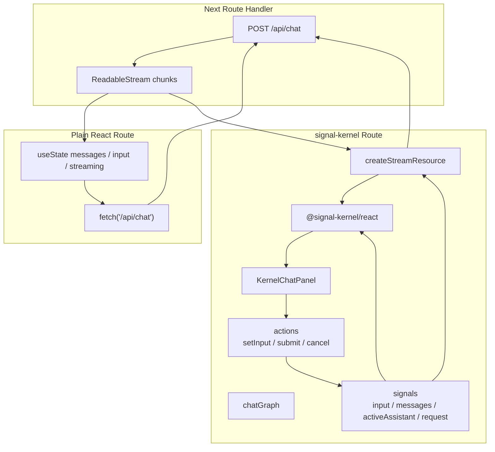
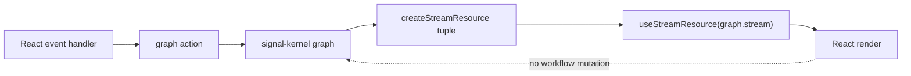

# RFC: Next AI Chatbot Streaming Example

Status: proposed

## Problem Statement

`signal-kernel` now has a framework-neutral core, async runtime, React adapter, and Vue adapter. The next streaming-oriented example should make the runtime model concrete in a familiar application shape: an AI chatbot.

Most chatbot examples put the whole workflow inside a component:

* input state
* message history
* active assistant draft
* streaming text
* request cancellation
* error handling
* final message commit

That is useful for a small demo, but it makes rendering the owner of the workflow. It also makes the boundary between UI state and async stream state unclear.

This example should demonstrate a different model:

> Model the chat workflow as a reactive graph. Treat React rendering as an effect over that graph.

The example does not need a real AI provider in the first version. A deterministic mock streaming route is enough to prove the runtime shape. The goal is to show how `signal-kernel` should be used in a real streaming UI when the provider is eventually replaced by OpenAI, Anthropic, a local model, or another streaming source.

---

## Positioning

This example is not an AI SDK.

It is not a provider abstraction, model router, RAG framework, tool-calling runtime, or agent framework.

It is a focused example for the lower-level runtime boundary:

```txt
chat workflow graph
  owns input, messages, active request, stream resource, and actions

Next route handler
  provides a streaming response

React adapter
  renders graph state into a client component
```

The intended mental model is:

```txt
user event -> graph action -> stream resource -> graph state -> React render
```

React should not own the stream lifecycle. React should call graph actions and render graph values through `@signal-kernel/react`.

---

## Goals

* Provide a minimal Next.js chatbot example.
* Include a plain React implementation as a control route.
* Include a `signal-kernel` implementation as the graph-first route.
* Use a shared streaming API route so both implementations exercise the same server behavior.
* Keep the `signal-kernel` chat workflow outside React component state.
* Use `createStreamResource()` for assistant streaming.
* Expose the raw stream resource tuple from the graph.
* Consume the stream tuple in React with `useStreamResource(graph.stream)`.
* Make partial assistant text visible while chunks arrive.
* Commit the assistant response into message history when the stream succeeds.
* Show where cancellation, partial state, and future snapshot boundaries belong.

---

## Non-Goals

* Connecting a real AI provider in the first version.
* Implementing RAG, tools, memory, or multi-agent planning.
* Implementing auth, persistence, analytics, or rate limiting.
* Implementing server-side conversation storage.
* Implementing snapshot capture or restore in this RFC.
* Making `@signal-kernel/react` own chatbot workflow semantics.
* Wrapping `createStreamResource()` into a React-specific resource shape.
* Teaching every Next.js AI deployment pattern.

---

## Core Scenario

The example should have two routes:

```txt
/plain
  plain React component state
  fetches the shared streaming API route directly
  appends chunks into component state

/signal-kernel
  creates a chat graph once
  graph owns message state and stream resource
  React renders through @signal-kernel/react
```

Both routes should call:

```txt
POST /api/chat
```

The route should return a streaming `Response` with text chunks. The first implementation can use deterministic mock chunks so the example runs without an API key.

---

## Architecture



The key rule is that `chatGraph` owns the workflow:



---

## Proposed Example Layout

```txt
examples/
  next-ai-chatbot/
    README.md
    package.json
    app/
      api/
        chat/
          route.ts
      components/
        ChatPanel.tsx
        ChatRouteShell.tsx
      plain/
        page.tsx
        PlainChatPanel.tsx
      signal-kernel/
        page.tsx
        chatGraph.ts
        KernelChatPanel.tsx
      chatTypes.ts
      layout.tsx
      page.tsx
```

The exact UI can remain simple. The important boundary is the split between the plain component-owned stream and the graph-owned stream.

---

## Graph Design

The `signal-kernel` implementation should expose a graph from `createChatGraph()`.

The graph should own source state:

```ts
const input = signal("");
const messages = signal<ChatMessage[]>([createWelcomeMessage()]);
const activeAssistant = signal<ChatMessage | null>(null);
const request = signal<ChatMessage[] | null>(null);
```

The graph should own derived state:

```ts
const canSubmit = computed(() => {
  return input.get().trim().length > 0 && activeAssistant.get() === null;
});
```

The graph should own streaming:

```ts
const stream = createStreamResource(
  () => request.get(),
  async (requestMessages, ctx) => {
    // fetch streaming response
    // emit chunks through ctx.emit()
    // finish through ctx.done()
  },
);
```

The graph should expose actions:

```ts
return {
  input,
  messages,
  activeAssistant,
  canSubmit,
  stream,
  actions: {
    setInput,
    submit,
    cancel,
  },
};
```

The stream must remain the raw `createStreamResource()` tuple. It should not be wrapped into a custom object that is incompatible with adapter APIs.

---

## React Adapter Boundary

The React component should create the graph once:

```ts
const graph = useMemo(() => createChatGraph(), []);
```

The component should read graph values through adapter hooks:

```ts
const input = useSignalValue(graph.input);
const messages = useSignalValue(graph.messages);
const activeAssistant = useSignalValue(graph.activeAssistant);
const canSubmit = useComputedValue(graph.canSubmit);
const [assistantText, assistantStream] = useStreamResource(graph.stream);
```

The component should call graph actions from event handlers:

```ts
function handleSubmit(event: FormEvent<HTMLFormElement>) {
  event.preventDefault();

  if (canSubmit) {
    graph.actions.submit();
  }
}
```

The component should not:

* subscribe to `signal-kernel` manually inside `useEffect()`
* mirror graph state into React `useState()`
* wrap or reshape the stream tuple
* create signal-kernel signals inside render logic for workflow state
* use React state as the source of truth for message history or stream status

React owns rendering. The graph owns workflow state.

---

## Stream Resource Contract

The stream resource should represent the active assistant response.

The value function should expose the accumulated assistant text:

```ts
const [assistantText, assistantStream] = graph.stream;
```

The metadata should expose stream status, errors, stable value, and cancellation:

```ts
assistantStream.status();
assistantStream.error();
assistantStream.stableValue();
assistantStream.cancel();
```

The React adapter should consume this through:

```ts
const [assistantText, assistantStream] = useStreamResource(graph.stream);
```

This is the main public usage pattern the example should teach.

---

## Plain React Control Route

The plain route should intentionally keep the stream inside component state:

* `messages`
* `input`
* `isStreaming`
* `AbortController`
* partial assistant message mutation

This route is not wrong. It is the control case.

The comparison should show that small streaming UIs can be implemented with React state, but workflow ownership becomes component-local. The `signal-kernel` route demonstrates how the same workflow can move into a framework-agnostic graph.

---

## Provider Boundary

The first version should use a mock streaming route.

The server route should accept a list of chat messages and return a text stream:

```txt
POST /api/chat
  request: { messages: ChatMessage[] }
  response: text/plain streaming Response
```

The route can later be replaced with a real AI provider, but that should not change the graph boundary.

The provider-specific code belongs behind the route handler or a provider module. It should not move chat workflow ownership into React.

Future provider integrations may include:

* OpenAI Responses API
* Anthropic streaming messages
* local model streaming
* internal gateway streaming

The graph should still consume a stream-like response and emit chunks through `createStreamResource()`.

---

## Expected Behavior

### Initial State

The page should render a welcome assistant message.

No stream request should be active before the user submits a prompt.

### Submit

When the user submits a prompt:

* the input is cleared
* a user message is appended
* an assistant draft becomes active
* the stream resource starts
* streamed chunks update the visible assistant draft

### Success

When the stream completes:

* the assistant draft is committed to message history
* the active assistant draft is cleared
* the request signal is reset
* the UI returns to an idle state

### Error

When the stream fails:

* the assistant draft should become an error message
* partial text may be preserved depending on stream resource policy
* the UI should allow another submission

### Cancel

When the user cancels:

* the stream resource should be cancelled
* partial text may be preserved
* the assistant message should be marked as aborted
* the UI should allow another submission

The current example may use stream resource cancellation as the graph-level cancellation boundary. A production provider integration should also connect cancellation to the underlying `fetch()` or provider stream when needed.

---

## Snapshot Discovery Questions

This RFC does not implement snapshot support, but the chatbot example should reveal concrete snapshot questions.

Future snapshot work should answer:

* Are committed messages source state?
* Is the active assistant draft source state or transient runtime state?
* Should partial assistant text be captured?
* Should stream status be captured, restored, or restarted?
* Should in-flight requests be cancelled on restore?
* Should `stableValue()` become part of a snapshot boundary?
* Should provider request metadata be serializable?
* Should a restored chatbot replay, resume, or discard an interrupted stream?
* How should errors and aborted messages be represented after restore?

The example should keep these questions visible without prematurely adding snapshot APIs.

---

## Testing Strategy

Tests should prioritize runtime semantics and adapter contracts.

Required graph-level tests:

* submitting a prompt appends a user message
* submitting a prompt creates an active assistant draft
* stream chunks accumulate into assistant text
* stream success commits the assistant message
* stream error commits an error message
* cancellation preserves or commits partial text according to policy
* `canSubmit` is false while an assistant stream is active

Required React adapter checks:

* `useStreamResource(graph.stream)` accepts the raw `createStreamResource()` tuple
* the component does not manually subscribe inside `useEffect()`
* graph state is not mirrored into React state
* object snapshots from adapter reads do not cause infinite React update loops

Required example checks:

* the example typechecks
* the example builds
* both routes can call the same streaming API route
* the signal-kernel route uses the graph as workflow owner

Tests should not inspect private async-runtime tokens or internal resource implementation details.

---

## Documentation Requirements

The example README should explain:

* why the example has a plain route and a signal-kernel route
* how the shared streaming API route works
* why the signal-kernel route creates a graph once
* why `chatGraph` owns workflow state
* why React consumes `graph.stream` with `useStreamResource(graph.stream)`
* why adapters should not reshape stream resources
* what parts would change when replacing the mock route with a real provider
* what snapshot questions the example intentionally leaves open

The README should avoid describing `signal-kernel` as an AI SDK or React chatbot library.

---

## Open Questions

### Should the first version connect to a real AI provider?

No.

The first version should stay provider-free so the runtime shape is easy to run and review. A provider integration can be added later after the graph boundary is stable.

### Should cancellation abort the underlying fetch?

Eventually, yes.

For the first graph example, stream resource cancellation is enough to demonstrate the graph-level boundary. A production provider integration should propagate cancellation to `AbortController`, the provider SDK, or the underlying stream reader.

### Should the graph expose writable signals directly?

For this example, exposing `input`, `messages`, and `activeAssistant` as readable graph values is acceptable because the example is small and local.

For larger examples, the preferred pattern is to expose selectors, resources, and actions while keeping raw writable signals private.

### Should this example become the first `ai-runtime` package design?

No.

This example should inform `ai-runtime`, but it should not define the package too early. The immediate goal is to validate streaming resource usage and identify the next layer of AI workflow abstractions.

---

## Decision

Build a Next.js chatbot streaming example with two routes:

* a plain React route that owns streaming state inside component state
* a signal-kernel route that owns streaming state inside a reactive graph

Use a deterministic mock streaming route instead of a real AI provider.

In the signal-kernel route, keep the workflow inside `chatGraph.ts`. Use `signal`, `computed`, and `createStreamResource()` to model input, message history, active assistant draft, request state, and streaming assistant text.

Expose the raw stream resource tuple as `graph.stream`.

In React, create the graph once with `useMemo()`, consume graph values through `@signal-kernel/react`, and pass `graph.stream` directly to `useStreamResource(graph.stream)`.

Do not manually subscribe to signal-kernel from React effects. Do not mirror graph state into React state. Do not wrap stream resources into incompatible shapes.

Use this example to teach real streaming usage and to discover future `snapshot` and `ai-runtime` boundaries.
