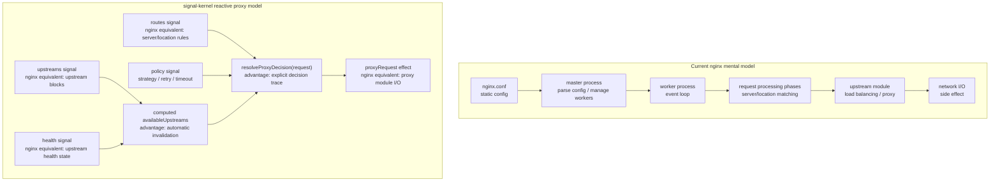
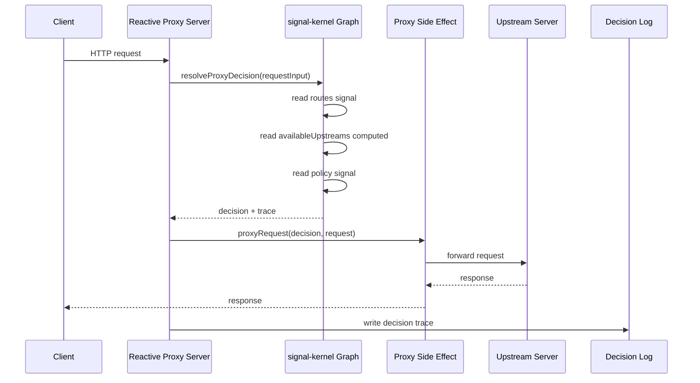
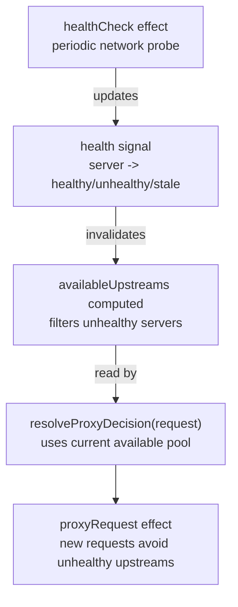
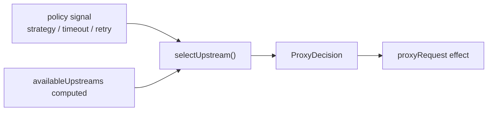
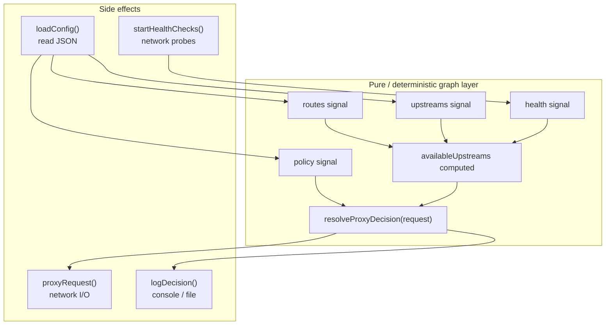
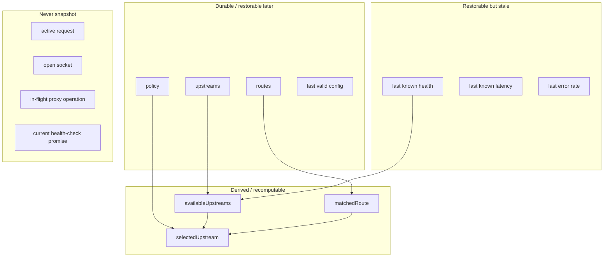

# RFC: Reactive Proxy Example - Modeling an Nginx-like Runtime with signal-kernel

## 0. Status

**Status:** Draft for agent implementation
**Target:** `examples/reactive-proxy`
**Implementation medium:** TypeScript / Node.js MVP.
**Primary goal:** Build a runnable example proving that an nginx-like routing / upstream / health / policy / proxy decision layer can be modeled as a reactive graph with signal-kernel.

This RFC is intentionally scoped as an **example**, not a production reverse proxy. The purpose is to demonstrate architectural validity and practical advantages, not to compete with nginx on C-level I/O performance.

TypeScript is used here because it is the fastest way to make the idea executable inside this repository. It is not a claim that a serious production proxy should be implemented in TypeScript. If this line of work eventually becomes a lower-level runtime, the graph model should remain portable enough to be rewritten in Rust, Go, or another systems-oriented language.

---

## 1. Problem Statement

Nginx is excellent at high-performance event-driven I/O, connection handling, static file serving, TLS termination, proxying, and worker lifecycle management.

However, from the perspective of signal-kernel, nginx-like systems also contain a decision layer:

* Which route matches this request?
* Which upstream pool should be used?
* Which upstream servers are currently available?
* Which policy should apply: first healthy, round-robin, retry, timeout, fallback?
* How do health changes affect future decisions?
* How can we trace why a request was routed to a specific target?

This example aims to prove that this decision layer can be represented as a **reactive graph**:

```txt
routes + upstreams + health + policy
  -> derived available upstreams
  -> proxy decision
  -> proxy side effect
```

The core claim is:

> signal-kernel is not only a UI state primitive. It can model runtime decision graphs where rendering, proxying, health checking, logging, and config generation are all side effects of dataflow.

The TypeScript MVP should therefore be read as an executable architecture sketch:

```txt
portable decision graph
  routes / upstreams / health / policy / derived decisions

Node.js effects
  HTTP server / health probes / proxy forwarding / logs
```

The value of the example is the boundary, not raw proxy throughput.

---

## 2. Goals

### 2.1 Primary Goals

1. Build a runnable HTTP reverse proxy example in TypeScript / Node.js.
2. Use `@signal-kernel/core` to model long-lived runtime state:

   * route config
   * upstream config
   * health state
   * traffic policy
3. Derive proxy decisions from the reactive graph.
4. Keep network proxying as a side effect, not as graph state.
5. Produce clear request decision traces showing how each request was routed.
6. Demonstrate automatic decision updates when health state or policy changes.
7. Provide enough structure that this example can later evolve into:

   * nginx sidecar/controller
   * ops-runtime prototype
   * Rust rewrite
   * optional snapshot / rollback layer

### 2.2 Secondary Goals

1. Show how nginx-like concepts map to signal-kernel concepts.
2. Make the architectural boundary obvious:

   * graph state
   * derived state
   * side effect boundary
   * ephemeral request state
3. Provide a README that explains why this is not merely a toy proxy.

---

## 3. Non-goals

The MVP must **not** attempt to implement:

1. TLS termination.
2. HTTP/2 or HTTP/3.
3. WebSocket proxying.
4. Static file serving.
5. Nginx-compatible config syntax.
6. Native nginx module integration.
7. OpenResty / njs integration.
8. Multi-process worker model.
9. Kernel-level socket optimization.
10. Snapshot / restore.
11. Production-grade load balancing.
12. Full streaming backpressure correctness beyond basic Node.js piping.

These are explicitly deferred.

---

## 3.1 Implementation Positioning

This example should be honest about TypeScript's role.

Nginx is built for high-throughput network I/O, memory efficiency, worker lifecycle management, and low-level socket behavior. This example is not trying to compete on those axes.

The TypeScript implementation is useful because it can prove the runtime model quickly:

* graph state is explicit
* derived routing decisions are testable
* policy changes invalidate future decisions
* health state affects routing without manual table rewrites
* request decisions can produce traces
* proxying stays outside the graph as an effect

The implementation should keep this boundary visible:

```txt
src/graph/*
  portable decision model
  no Node.js imports
  no network I/O
  no timers
  no filesystem

src/effects/*
  Node.js implementation details
  HTTP forwarding
  health probes
  logging
  intervals
```

If the idea is later moved to Rust, the graph model and tests should provide the conceptual contract. The Node.js proxy implementation can be discarded without losing the design.

---

## 4. Key Design Principle

Do **not** model each incoming request as a global signal.

A global `requestSignal` would be unsafe because concurrent requests could overwrite each other and contaminate decision state.

Instead:

```txt
Long-lived graph state:
  routes signal
  upstreams signal
  health signal
  policy signal
  round-robin cursor signal, if the selected policy needs it
  computed available upstreams

Per-request ephemeral input:
  method
  path
  headers
  body stream

Decision resolver:
  resolveProxyDecision(requestInput)
```

This means:

* signal-kernel owns long-lived runtime state and derived decision tables.
* each request is passed as an argument to a resolver.
* proxying remains a side effect.
* active requests are not restorable and should not be snapshotted.
* request input should never become shared mutable graph state.
* policy runtime cursors are graph state only when they represent long-lived policy behavior, not request data.

---

## 5. Nginx vs signal-kernel Mapping

| Nginx concept                  | Current nginx role                   | signal-kernel modeled role                         | signal-kernel advantage                                           |
| ------------------------------ | ------------------------------------ | -------------------------------------------------- | ----------------------------------------------------------------- |
| `nginx.conf`                   | Static config source                 | `routes`, `upstreams`, `policy` signals            | Config becomes mutable graph state, not only static text          |
| `server` / `location` matching | Request routing rules                | `matchRoute(request)` over route signal            | Route decision can be traced and tested as explicit logic         |
| `upstream` block               | Defines backend server groups        | `upstreams` signal                                 | Upstream pools become reactive source state                       |
| Passive / active health checks | Mark upstreams failed or healthy     | `health` signal updated by health-check effect     | Health is graph state and automatically affects derived decisions |
| Load balancing                 | Selects upstream server              | `selectUpstream()` with policy signal              | Policy is explicit, dynamic, and traceable                        |
| Proxy module                   | Performs network proxying            | `proxyRequest()` effect                            | Proxying is isolated as side effect                               |
| Access/error logs              | Observability output                 | `logDecision()` effect                             | Logs can include graph-level decision trace                       |
| Reload                         | Re-read config and start new workers | Future config validation / graph commit / rollback | Future snapshot boundary becomes clearer                          |
| Worker process event loop      | High-performance I/O execution       | Out of scope for TS MVP                            | Can later be rewritten in Rust without changing conceptual model  |

---

## 6. Architecture Overview



### Interpretation

The TypeScript MVP does not replace nginx's worker/event-loop architecture. It proves that the decision layer can be represented as a reactive graph.

The important difference is:

```txt
nginx:
  request processing flow contains decision logic inside module phases

signal-kernel:
  decision logic is explicit graph-derived state
  proxying is only the final side effect
```

---

## 7. Runtime Flow



### signal-kernel advantage

The graph can explain **why** a decision was made:

```txt
request: GET /api/users
matched route: /api -> api-pool
candidate upstreams: api-a, api-b, api-c
health filter: api-a unhealthy, api-b healthy, api-c healthy
policy: round-robin
selected upstream: api-c
side effect: proxy to http://localhost:3003/api/users
```

---

## 8. Health State Flow



### Nginx mapping

* Corresponds to nginx upstream health state / passive or active health check behavior.
* In signal-kernel, health is not just a background event; it is graph state.

### signal-kernel advantage

When health changes:

```txt
health changed
  -> availableUpstreams invalidated
  -> future decisions read the latest pool
  -> no manual route-table invalidation needed
```

---

## 9. Policy Flow



### Nginx mapping

* Corresponds to load-balancing policy, retry behavior, timeout settings, and upstream selection.

### signal-kernel advantage

Policy is explicit runtime state. Future versions can change policy dynamically without rewriting proxy handlers.

Examples:

```txt
first-healthy
round-robin
least-latency
fail-fast
retry-once
```

MVP must implement only:

1. `first-healthy`
2. `round-robin`

---

## 10. Side Effect Boundary



### Rule

Effects may update signals, but graph derivations must not perform effects.

Forbidden:

```txt
computed(() => fetch(...))
computed(() => writeFile(...))
computed(() => proxyRequest(...))
```

Allowed:

```txt
healthCheck effect -> writes health signal
request handler -> calls resolveProxyDecision(request)
request handler -> calls proxyRequest(decision, request)
```

---

## 11. Future Snapshot Boundary

Snapshot is **not** part of MVP. However, the example must preserve a clean boundary for future snapshot support.



### Important

This confirms that an nginx-like example does not require snapshot first.

MVP behavior after restart:

```txt
reload config
initialize graph
health state starts as stale or unknown
health checks update state
new requests use current graph state
```

---

## 12. Proposed Directory Structure

```txt
examples/
  reactive-proxy/
    README.md
    package.json
    tsconfig.json
    src/
      index.ts
      server.ts

      config/
        default-config.ts
        load-config.ts
        schema.ts

      graph/
        routes.ts
        upstreams.ts
        health.ts
        policy.ts
        available-upstreams.ts
        decision.ts

      effects/
        proxy-request.ts
        health-check.ts
        decision-log.ts

      demo/
        upstream-a.ts
        upstream-b.ts
        upstream-c.ts
        start-demo-upstreams.ts

      tests/
        decision.test.ts
        health.test.ts
        policy.test.ts
```

---

## 13. Data Model

### 13.1 Route Config

```ts
export interface RouteRule {
  id: string
  pathPrefix: string
  upstreamPool: string
}
```

Example:

```ts
const routes = signal<RouteRule[]>([
  { id: 'api', pathPrefix: '/api', upstreamPool: 'api-pool' },
  { id: 'web', pathPrefix: '/web', upstreamPool: 'web-pool' },
])
```

MVP route matching rule:

```txt
longest pathPrefix wins
same-length matches use config order
```

This avoids ambiguity for routes such as `/api` and `/api/admin` without adding a full nginx-compatible location matching system.

### 13.2 Upstream Config

```ts
export interface UpstreamServer {
  id: string
  url: string
}

export type UpstreamPools = Record<string, UpstreamServer[]>
```

Example:

```ts
const upstreams = signal<UpstreamPools>({
  'api-pool': [
    { id: 'api-a', url: 'http://localhost:3001' },
    { id: 'api-b', url: 'http://localhost:3002' },
  ],
  'web-pool': [
    { id: 'web-a', url: 'http://localhost:3003' },
  ],
})
```

### 13.3 Health State

```ts
export type HealthStatus = 'unknown' | 'healthy' | 'unhealthy' | 'stale'

export interface ServerHealth {
  status: HealthStatus
  checkedAt?: number
  latencyMs?: number
  error?: string
}

export type HealthMap = Record<string, ServerHealth>
```

### 13.4 Traffic Policy

```ts
export type LoadBalancingStrategy = 'first-healthy' | 'round-robin'

export interface TrafficPolicy {
  strategy: LoadBalancingStrategy
  timeoutMs: number
  retry: number
}
```

Round-robin needs a cursor. That cursor is runtime policy state, not request state.

Recommended MVP shape:

```ts
export type RoundRobinCursor = Record<string, number>
```

The cursor should be scoped by upstream pool. It should not be part of durable config. Future snapshot work may decide whether to restore it, but the MVP should treat it as ephemeral runtime state.

### 13.5 Request Input

```ts
export interface RequestInput {
  method: string
  path: string
  headers: Record<string, string | string[] | undefined>
}
```

Request input must remain ephemeral and must not be stored in global graph state.

### 13.6 Proxy Decision

```ts
export interface ProxyDecision {
  ok: true
  routeId: string
  upstreamPool: string
  upstreamId: string
  targetUrl: string
  trace: DecisionTraceStep[]
}

export interface ProxyRejectDecision {
  ok: false
  statusCode: 404 | 503
  reason: string
  trace: DecisionTraceStep[]
}

export type Decision = ProxyDecision | ProxyRejectDecision

export interface DecisionTraceStep {
  stage: string
  message: string
  data?: unknown
}
```

---

## 14. Graph Modules

### 14.1 `routes.ts`

Responsibilities:

* export `routes` signal
* provide helper to replace routes
* no network I/O

### 14.2 `upstreams.ts`

Responsibilities:

* export `upstreams` signal
* provide helper to replace upstream pools
* no network I/O

### 14.3 `health.ts`

Responsibilities:

* export `health` signal
* provide `setServerHealth(serverId, health)`
* no direct health checking logic here

### 14.4 `policy.ts`

Responsibilities:

* export `policy` signal
* provide `setPolicy(nextPolicy)`

### 14.5 `available-upstreams.ts`

Responsibilities:

* export computed `availableUpstreams`
* derive healthy upstreams from `upstreams()` and `health()`
* unknown/stale behavior:

  * MVP option A: treat `unknown` and `stale` as unavailable
  * MVP option B: treat `unknown` as available until first check

Recommended MVP behavior:

```txt
healthy: available
unknown: available
stale: unavailable
unhealthy: unavailable
```

Reason:

* keeps initial demo usable before first health check
* still demonstrates stale as lower-trust state later

### 14.6 `decision.ts`

Responsibilities:

* export `resolveProxyDecision(requestInput)`
* read current `routes()`, `availableUpstreams()`, and `policy()`
* return a decision plus trace
* no network I/O
* no signal writes except round-robin cursor updates if the active policy requires them

Round-robin cursor should be isolated and minimal.

To keep the boundary clear, the decision module may be structured as:

```txt
matchRoute(requestInput)
  pure route matching

buildDecisionContext(requestInput)
  reads graph state
  prepares route, pool, candidates, health, and policy trace

selectUpstream(context)
  may advance round-robin cursor
  returns selected upstream and policy trace

resolveProxyDecision(requestInput)
  combines the above into an accepted or rejected decision
```

This means route matching and candidate filtering stay pure, while the only allowed stateful decision step is the policy cursor update.

---

## 15. Effects

### 15.1 `health-check.ts`

Responsibilities:

* periodically probe upstream URLs
* update `health` signal
* never perform routing decision

Pseudo-flow:

```txt
for each upstream server:
  GET /health
  if ok -> set health healthy + latency
  else -> set health unhealthy + error
```

### 15.2 `proxy-request.ts`

Responsibilities:

* accept Node.js incoming request and server response
* call `resolveProxyDecision(requestInput)` before proxying
* if decision rejected:

  * return 404 for no route
  * return 503 for no available upstream
* if decision accepted:

  * forward request to target upstream
  * pipe response back to client
* log decision trace

The MVP can use Node.js `http.request` for clearer proxy semantics around method, headers, body forwarding, and response piping.

Using `fetch()` is acceptable for a simpler first pass, but the README should state that full streaming backpressure behavior is outside the MVP.

### 15.3 `decision-log.ts`

Responsibilities:

* print structured logs to console
* include graph-level decision trace

Example:

```txt
[request] GET /api/users
[route] matched /api -> api-pool
[health] available upstreams: api-b, api-c
[policy] strategy: round-robin
[decision] selected api-c -> http://localhost:3003
[effect] proxy request
```

---

## 16. Demo Upstream Services

Create three fake upstream services:

```txt
api-a: http://localhost:3001
api-b: http://localhost:3002
web-a: http://localhost:3003
```

Each service should expose:

```txt
GET /health
GET /*
```

Response body should identify the upstream:

```json
{
  "upstream": "api-a",
  "path": "/api/users"
}
```

For demo purposes, allow one upstream to simulate failure:

```txt
GET /toggle-health
```

or use an in-memory flag in the demo service.

---

## 17. MVP User Stories

### Story 1: Basic route matching

As a developer, I can send:

```txt
GET http://localhost:8080/api/users
```

Expected:

```txt
request routes to api-pool
response comes from api-a or api-b
log shows route decision trace
```

### Story 2: Health state affects routing

When `api-a` becomes unhealthy:

Expected:

```txt
future /api requests avoid api-a
availableUpstreams recomputes automatically
log shows api-a excluded by health state
```

### Story 3: Policy affects routing

When policy changes from `first-healthy` to `round-robin`:

Expected:

```txt
future requests rotate through available upstreams
log shows active policy
```

### Story 4: No available upstream

When all upstreams in a pool are unhealthy:

Expected:

```txt
proxy returns HTTP 503
log shows route matched but no available upstream
```

### Story 5: No matching route

When request path does not match any route:

Expected:

```txt
proxy returns HTTP 404
log shows no route matched
```

---

## 18. Agent Implementation Plan

### Step 1: Scaffold example package

Create:

```txt
examples/reactive-proxy/package.json
examples/reactive-proxy/tsconfig.json
examples/reactive-proxy/src/index.ts
```

Add scripts:

```json
{
  "name": "@signal-kernel/example-reactive-proxy",
  "private": true,
  "scripts": {
    "dev": "tsx src/index.ts",
    "test": "vitest"
  }
}
```

Use dependencies already available in the monorepo where possible.

### Step 2: Implement data model and default config

Files:

```txt
src/config/schema.ts
src/config/default-config.ts
```

### Step 3: Implement graph modules

Files:

```txt
src/graph/routes.ts
src/graph/upstreams.ts
src/graph/health.ts
src/graph/policy.ts
src/graph/available-upstreams.ts
src/graph/decision.ts
```

Required behavior:

* `availableUpstreams` must be a computed value.
* `resolveProxyDecision()` must return trace.
* request input must not be written into global signal state.
* route matching must use longest `pathPrefix` wins.
* round-robin cursor must be scoped by upstream pool and treated as ephemeral runtime state.

### Step 4: Implement demo upstream services

Files:

```txt
src/demo/start-demo-upstreams.ts
```

Start three simple HTTP servers.

### Step 5: Implement health check effect

Files:

```txt
src/effects/health-check.ts
```

Behavior:

* run interval every 2 seconds
* call `/health` on each upstream
* update `health` signal

### Step 6: Implement proxy request effect

Files:

```txt
src/effects/proxy-request.ts
```

Behavior:

* create HTTP proxy behavior with Node.js `http` module or built-in `fetch`
* preserve method and path
* basic body forwarding is enough for MVP
* return upstream response to client

### Step 7: Implement server entry

Files:

```txt
src/server.ts
src/index.ts
```

Behavior:

* start demo upstreams
* start health checks
* start proxy server at `localhost:8080`
* print startup instructions

### Step 8: Add tests

Files:

```txt
src/tests/decision.test.ts
src/tests/health.test.ts
src/tests/policy.test.ts
```

Minimum tests:

1. route match returns correct upstream pool
2. no route returns 404 decision
3. all unhealthy returns 503 decision
4. health update changes available upstreams
5. round-robin rotates available upstreams

---

## 19. Acceptance Criteria

The example is complete when all of the following are true:

1. `pnpm -F @signal-kernel/example-reactive-proxy dev` or equivalent starts the demo.
2. `GET /api/*` routes to `api-pool`.
3. `GET /web/*` routes to `web-pool`.
4. Health check updates are visible in logs.
5. Unhealthy upstreams are excluded from future decisions.
6. Decision logs clearly show:

   * request
   * matched route
   * candidate upstreams
   * health filtering result
   * active policy
   * selected upstream
   * proxy side effect
7. Tests pass.
8. README explains:

   * nginx mapping
   * signal-kernel graph model
   * why TypeScript is used as an executable prototype, not a performance claim
   * why request is not global signal
   * why proxying is side effect
   * why snapshot is not required for MVP

---

## 20. README Outline

The example README should contain:

```md
# Reactive Proxy: Modeling an Nginx-like Runtime with signal-kernel

## What this example demonstrates

This example demonstrates that routing, upstream health, traffic policy, and proxy decisions can be modeled as a reactive graph.

## What this is not

This is not a production nginx replacement.
This is not a high-performance C/Rust proxy.
This is not a native nginx module.

## Why TypeScript?

TypeScript is used to make the runtime model executable inside this repository.
The goal is to prove the decision graph boundary, not to compete with nginx on I/O throughput.
The graph layer is intentionally kept portable so the model could later be rewritten in Rust or another systems language.

## Why signal-kernel?

- routing decision as graph output
- health state as graph state
- policy as reactive runtime state
- proxying as side effect
- decision trace as observability

## Architecture

Include mermaid diagram.

## Run

pnpm -F @signal-kernel/example-reactive-proxy dev

## Try

curl http://localhost:8080/api/users
curl http://localhost:8080/web/home

## Key idea

Rendering is one side effect.
Proxying is another side effect.
The kernel owns the dataflow and decision graph.
```

---

## 21. Implementation Notes for Agent

### 21.1 Keep the graph layer pure

The graph layer must not import Node.js `http`, `fs`, or networking utilities.

Allowed in graph:

```txt
signal
computed
plain functions
plain TypeScript types
```

Forbidden in graph:

```txt
fetch
http.request
fs.writeFile
setInterval
console.log, except temporary debugging
```

### 21.2 Keep effects explicit

Effects may:

* perform network I/O
* update signals
* log output
* start intervals

Effects must not hide decision logic.

### 21.3 Preserve future Rust portability

Avoid Node-specific APIs inside graph modules. The graph model should be portable to Rust later.

Good boundary:

```txt
graph/*   -> portable decision model
effects/* -> Node.js implementation details
```

### 21.4 Do not overbuild

Do not add:

* config hot reload
* dashboard UI
* snapshot
* database
* Docker
* native nginx module
* OpenResty integration

until MVP is complete.

---

## 22. Expected Outcome

After MVP, this example should prove the following claim:

> An nginx-like proxy runtime can be decomposed into durable config state, ephemeral health state, graph-derived routing decisions, and external proxy side effects. signal-kernel is useful because it makes the decision layer explicit, reactive, testable, traceable, and extensible.

This is enough to support the broader signal-kernel thesis:

> signal-kernel is not merely frontend state management. It is a runtime kernel for modeling decision graphs where UI rendering, proxying, ops workflows, and AI workflows are all side effects of dataflow.
