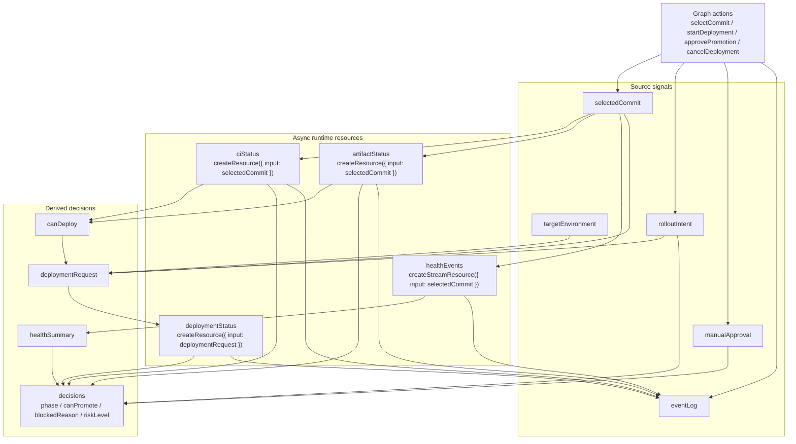
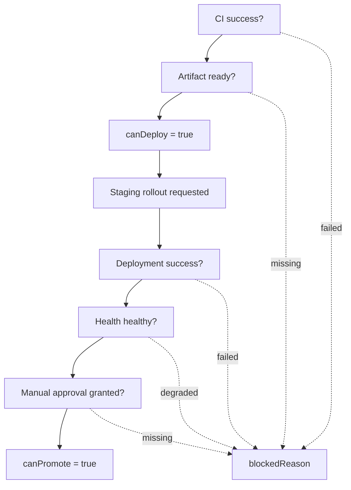
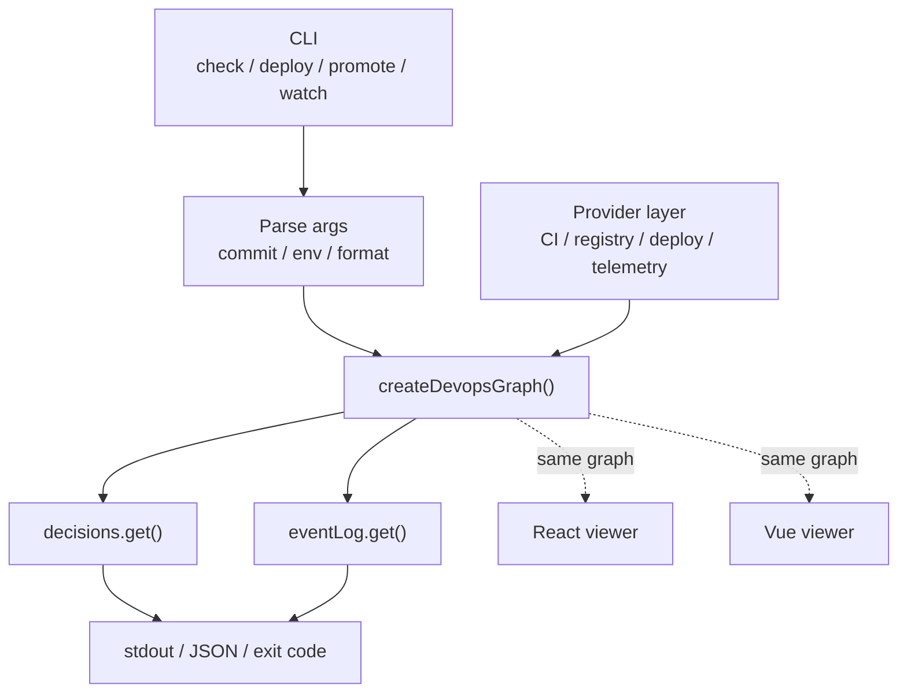

# DevOps Runtime Example

This example is a skeleton for modeling DevOps operational state as a deterministic `signal-kernel` graph.

It is not a CI/CD platform, dashboard framework, OpenTelemetry replacement, Kubernetes replacement, or workflow engine. It is a pressure-test for how TypeScript can model operational state before future snapshot and possible ops-runtime package work.

## What This Proves

The graph owns:

* selected commit
* CI status
* artifact readiness
* staging deployment status
* health stream events
* manual approval
* derived decisions such as `canDeploy`, `canPromote`, `blockedReason`, and `riskLevel`

React and Vue only render the graph through thin adapters. Both use
`useKernelValue()` for synchronous readable graph values, while resources and
streams remain on their dedicated adapter hooks.

## Runtime Graph

The example is organized around `createDevopsGraph()`. The graph separates source signals, async resources, stream resources, derived decisions, and actions.



The important boundary is that the graph is headless. React and Vue are only consumers of the final graph state.

## Promotion Gate

The `decisions` computed value turns operational inputs into promotion eligibility.



This is why the example is closer to a control-plane graph than a dashboard. The UI displays the decision; it does not own the decision.

## CLI Direction

A realistic DevOps tool would likely consume the same graph from a CLI or headless runtime.



The current React and Vue panels are viewers. A future CLI could create the same graph, feed it provider data, read `decisions.get()`, and return stdout, JSON, or an exit code.

## Scenario

```txt
select commit
-> CI checks run
-> artifact becomes available
-> staging rollout starts
-> health events stream in
-> graph computes promotion eligibility
-> manual approval is granted
-> production promotion becomes allowed or blocked
```

The fake fixtures include:

```txt
commit-a: slow but healthy rollout
commit-b: fast checks, degraded health
commit-c: medium checks with healthy rollout
```

Switching commits while work is running should not allow stale CI, artifact, deployment, or health results to become authoritative.

## Run

```sh
pnpm -F @signal-kernel/example-devops-runtime dev
```

## Build

```sh
pnpm -F @signal-kernel/example-devops-runtime build
```

## Test

```sh
pnpm -F @signal-kernel/example-devops-runtime test
```

The tests focus on graph semantics, not UI internals:

* stale CI results are ignored after commit switching
* promotion requires CI, artifact, rollout, health, and approval
* degraded health blocks promotion

## Structure

```txt
src/
  graph/
    commits.ts
    fakeArtifactApi.ts
    fakeCiApi.ts
    fakeDeploymentApi.ts
    fakeHealthStream.ts
    devopsGraph.ts
    devopsGraph.test.ts
    types.ts
  react/
    ReactPanel.tsx
  vue/
    VuePanel.ts
```

The graph is intentionally framework-neutral. The UI exists to make the operational state visible.
