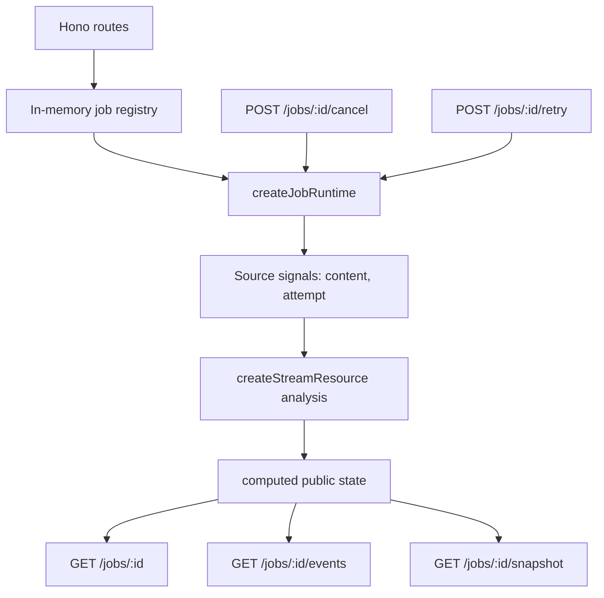

# Hono Reactive Job Runtime Example

This example demonstrates a Hono API server whose long-running job lifecycle is
owned by a `signal-kernel` reactive graph.

The point is not to replace a database, queue, or worker system. V1 is an
in-memory single-process demo that shows how backend job state can be modeled as
a graph instead of being scattered across route handlers.

```txt
Hono route
  -> sends a command into the job runtime
  -> signal-kernel owns async execution and derived state
  -> SSE follows public state changes
  -> snapshot exports the current graph boundary
```

## What This Proves

The example models a mock document analysis job:

```txt
parse_document
  -> extract_keywords
  -> summarize_sections
  -> generate_report
```

The job runtime uses:

* `signal()` for source state such as `content` and `attempt`
* `createStreamResource()` for the long-running async job
* `computed()` for derived public state such as `status`, `progress`,
  `canCancel`, `canRetry`, and `visibleResult`
* `createEffect()` only as the notification bridge for SSE subscribers
* `@signal-kernel/snapshot` for `GET /jobs/:id/snapshot`

Route handlers stay thin. They create jobs, read state, call `cancel()` or
`retry()`, subscribe to events, or return snapshots. They do not manually
maintain progress, status, retry flags, or visible results.

## Run

```sh
pnpm -F @signal-kernel/example-hono-reactive-job-runtime dev
```

The server uses `127.0.0.1:3000` by default.

## API

### Health Check

```sh
curl http://localhost:3000/health
```

### Create A Job

```sh
curl -X POST http://localhost:3000/jobs/analyze \
  -H "Content-Type: application/json" \
  -d "{\"content\":\"This is a long document to analyze.\"}"
```

Response:

```json
{
  "jobId": "job_1",
  "status": "pending"
}
```

The returned status is the runtime status at response time. Because the mock job
is asynchronous, it may already be `running` or `success` on a fast machine.

### Read Job State

```sh
curl http://localhost:3000/jobs/<jobId>
```

Response shape:

```json
{
  "id": "job_1",
  "status": "running",
  "progress": 45,
  "currentStep": "extract_keywords",
  "partialResult": "Extracted core keywords and topic candidates.",
  "stableResult": null,
  "visibleResult": "Extracted core keywords and topic candidates.",
  "error": null,
  "canCancel": true,
  "canRetry": false,
  "isTerminal": false
}
```

### Subscribe With SSE

```sh
curl http://localhost:3000/jobs/<jobId>/events
```

The SSE stream emits state updates:

```txt
event: state
data: {...}
```

When the job reaches a terminal state, it emits:

```txt
event: done
data: {...}
```

Terminal states are `success`, `error`, and `cancelled`.

### Cancel A Job

```sh
curl -X POST http://localhost:3000/jobs/<jobId>/cancel
```

Cancellation is delegated to the stream resource metadata. The runtime uses
`onCancel: "keep-partial"` so the latest partial result remains visible.

### Retry A Job

```sh
curl -X POST http://localhost:3000/jobs/<jobId>/retry
```

Retry is only allowed after `error` or `cancelled`. It updates the source
`attempt` signal, which lets `createStreamResource()` own invalidation and the
next run.

### Snapshot A Job

```sh
curl http://localhost:3000/jobs/<jobId>/snapshot
```

The response includes a real `signal-kernel.snapshot.v1` document:

```json
{
  "id": "job_1",
  "snapshot": {
    "schema": "signal-kernel.snapshot.v1",
    "graph": {
      "id": "hono-reactive-job",
      "instanceId": "job_1",
      "version": "0.1.0"
    },
    "createdAt": 123,
    "nodes": []
  }
}
```

Snapshot V1 is an inspection and transfer boundary. The stream resource is
captured with `restore: "inspect-only"`; this example does not claim that a
running async job can be resumed from a snapshot.

The original `content` signal is redacted in the snapshot and only exposes its
length.

## Architecture



## Non-Goals

V1 intentionally does not include:

* database persistence
* Redis
* queue workers
* multi-process coordination
* authentication
* real file upload
* real AI provider integration
* restore of a running job from snapshot

Those belong to later examples or future packages. This version focuses on the
runtime model.

## Typecheck

```sh
pnpm -F @signal-kernel/example-hono-reactive-job-runtime typecheck
```

## Test

```sh
pnpm -F @signal-kernel/example-hono-reactive-job-runtime test
```
