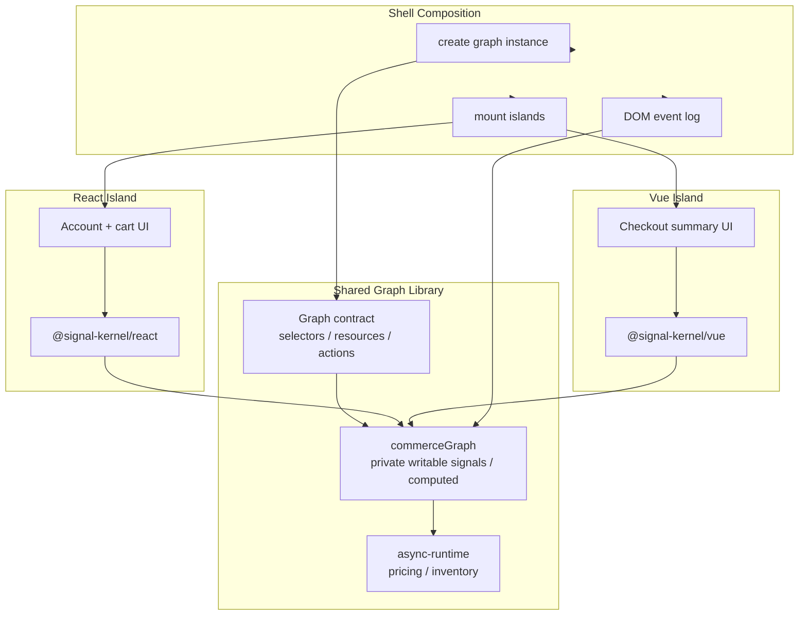
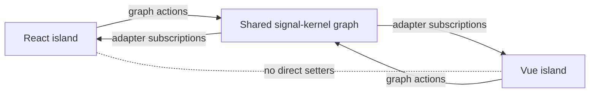

# Micro Frontend Runtime Example

This example models a monorepo-style micro frontend boundary with a shared `signal-kernel` graph library.

It does not use Module Federation, single-spa, import maps, or a production MFE runtime in phase 1. The point is to prove the lower-level runtime boundary first:

```txt
shared graph library -> independently mounted islands -> no framework-to-framework state coupling
```

## What This Proves

The shell creates one graph instance and injects a graph contract into independently mounted islands.

The graph contract exposes:

* selectors
* resources
* actions

Raw writable signals remain private to `src/shared-graph/`.

React and Vue do not call each other. They communicate by reading graph state through adapters and by requesting state changes through graph actions.

## Selector Contract Note

This example introduces a local `createSelector()` helper in `src/shared-graph/selector.ts`.

The helper intentionally primes a computed value before exposing it as part of the public graph contract:

```ts
export function createSelector<T>(read: () => T): Readable<T> {
  const memo = computed(read);

  memo.get();

  return {
    get: memo.get,
    peek: memo.peek,
  };
}
```

This is a deliberate graph-contract decision.

React's adapter reads `peek()` for the initial `useSyncExternalStore` snapshot. A lazy computed value may not have a cached value until `get()` has run at least once. If a public selector exposes an unprimed computed, a React island can see `undefined` on first render even though the selector's logical type is non-null.

The shared graph library takes responsibility for that boundary:

* public selectors should be adapter-safe
* public selectors should have a valid initial snapshot
* public selectors should provide stable snapshot identity when possible
* writable signals remain private
* islands should not need to know whether a selector is backed by a signal or a computed value

This helper is local to the example for now. It is not yet a public `@signal-kernel/core` API. The example keeps it local so the selector contract can be tested before promoting the pattern into the runtime packages.

## Architecture



The key rule is that React and Vue do not synchronize directly.



## Scenario

The example uses a small commerce shell:

* React island: account, region, and cart editor
* Vue island: checkout summary, pricing, and inventory status
* DOM island: shared graph event log

Changing account, region, or cart contents in the React island updates the Vue island through the shared graph.

Pricing and inventory are async resources. If account or region changes quickly, stale async results are ignored by `@signal-kernel/async-runtime`.

## Runtime Identity Caveat

This local Vite example uses shell dependency injection to pass one graph contract to both islands.

In a production MFE setup, the shell must still guarantee compatible runtime identity:

* one shared graph instance when live state should be shared
* compatible `@signal-kernel/core` and adapter versions
* compatible graph contract versions
* compatible snapshot versions if snapshot is introduced later

If two islands load separate graph instances, they will not share state even if they import the same source code.

## Run

```sh
pnpm -F @signal-kernel/example-micro-frontend-runtime dev
```

The dev server uses port `5175`.

## Build

```sh
pnpm -F @signal-kernel/example-micro-frontend-runtime build
```

## Test

```sh
pnpm -F @signal-kernel/example-micro-frontend-runtime test
```

The tests focus on graph semantics:

* the public contract does not expose raw writable signals
* graph actions update shared state for all islands
* selector array values cannot mutate graph internals
* stale pricing results do not overwrite the latest request
* checkout requires cart contents, pricing, inventory, and entitlement

## Structure

```txt
src/
  shared-graph/
    commerceGraph.ts
    commerceGraph.test.ts
    graphContract.ts
    selector.ts
    fakeInventoryApi.ts
    fakePricingApi.ts
    fixtures.ts
    types.ts
  react-island/
    AccountCartIsland.tsx
  vue-island/
    CheckoutSummaryIsland.ts
  shell/
    mountShell.tsx
```

In a real Nx or Turborepo setup, `src/shared-graph/` is the part that would become a workspace library consumed by multiple framework apps.
