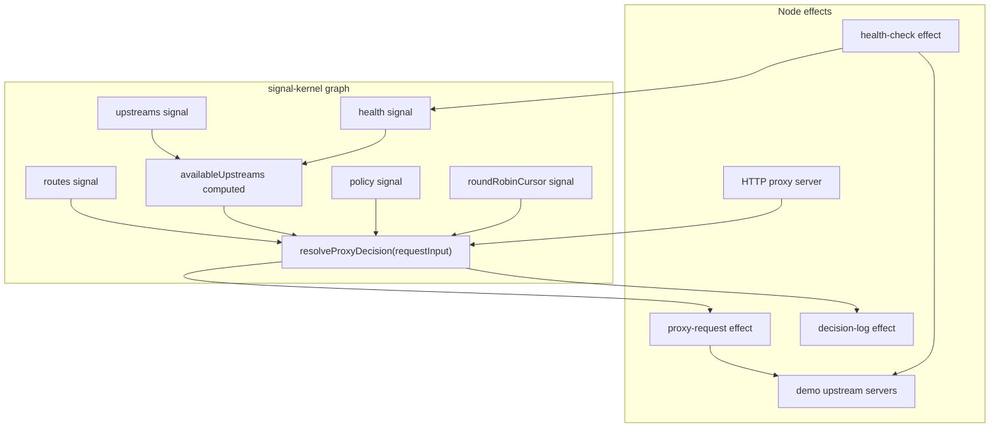

# Reactive Proxy Example

This example models an nginx-like routing, upstream health, policy, and proxy decision layer as a `signal-kernel` graph.

It uses TypeScript and Node.js as an executable prototype. It is not a production nginx replacement and does not claim to compete on network I/O throughput.

## What This Demonstrates

The decision layer is graph-owned:

```txt
routes + upstreams + health + policy
  -> availableUpstreams
  -> resolveProxyDecision(requestInput)
  -> decision trace
  -> proxy request effect
```

Proxying, health probes, logging, and server startup are explicit effects outside the graph.

The important boundary is:

```txt
src/graph/*
  portable decision model
  no Node.js HTTP APIs
  no timers
  no filesystem

src/effects/*
  Node.js side effects
  health probes
  proxy forwarding
  decision logs
```

Incoming requests are not stored in a global signal. They are ephemeral inputs passed to `resolveProxyDecision(requestInput)`.

## What This Is Not

This is not:

* a production nginx replacement
* a high-throughput reverse proxy
* a TLS terminator
* an HTTP/2, HTTP/3, or WebSocket proxy
* an nginx-compatible config parser
* a native nginx module

The goal is to make the routing decision layer explicit, reactive, testable, and traceable.

## Run

```sh
pnpm -F @signal-kernel/example-reactive-proxy dev
```

The dev script starts:

```txt
proxy        http://localhost:18080
api-a        http://localhost:3001
api-b        http://localhost:3002
web-a        http://localhost:3003
api-admin-a  http://localhost:3004
```

The proxy port can be overridden with `REACTIVE_PROXY_PORT` or `PORT`.

## Try

```sh
curl http://localhost:18080/api/users
curl http://localhost:18080/api/admin/users
curl http://localhost:18080/web/home
```

Toggle one upstream health state:

```sh
curl http://localhost:3001/toggle-health
```

The health-check effect updates graph health state, and future proxy decisions avoid unhealthy upstreams.

The console log shows a decision trace:

```txt
[request] GET /api/users
[route] Matched /api -> api-pool
[health] Available upstreams: api-a, api-b
[policy] Using first-healthy
[decision] Selected api-a
[effect] proxy request -> http://localhost:3001/api/users
```

## Test

```sh
pnpm -F @signal-kernel/example-reactive-proxy test
```

The tests cover:

* longest `pathPrefix` route matching
* 404 when no route matches
* 503 when a matched pool has no available upstreams
* health state changing available upstreams
* first healthy upstream selection
* per-pool round-robin selection
* real HTTP proxy forwarding
* health-check integration with future routing
* runtime close releasing ports

## Architecture



## Snapshot Boundary

The graph layer stays portable. Proxying, health probes, logging, and server startup belong in an effects layer.

Future snapshot work should treat these differently:

* durable or restorable: routes, upstream config, traffic policy
* recomputable: available upstreams, matched route, selected upstream
* stale or optional: last known health, latency, error state
* never snapshot: active request, open socket, in-flight proxy operation, current health-check promise

This is why the example keeps request input outside global graph state.
