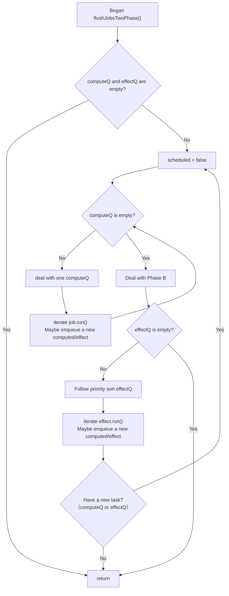
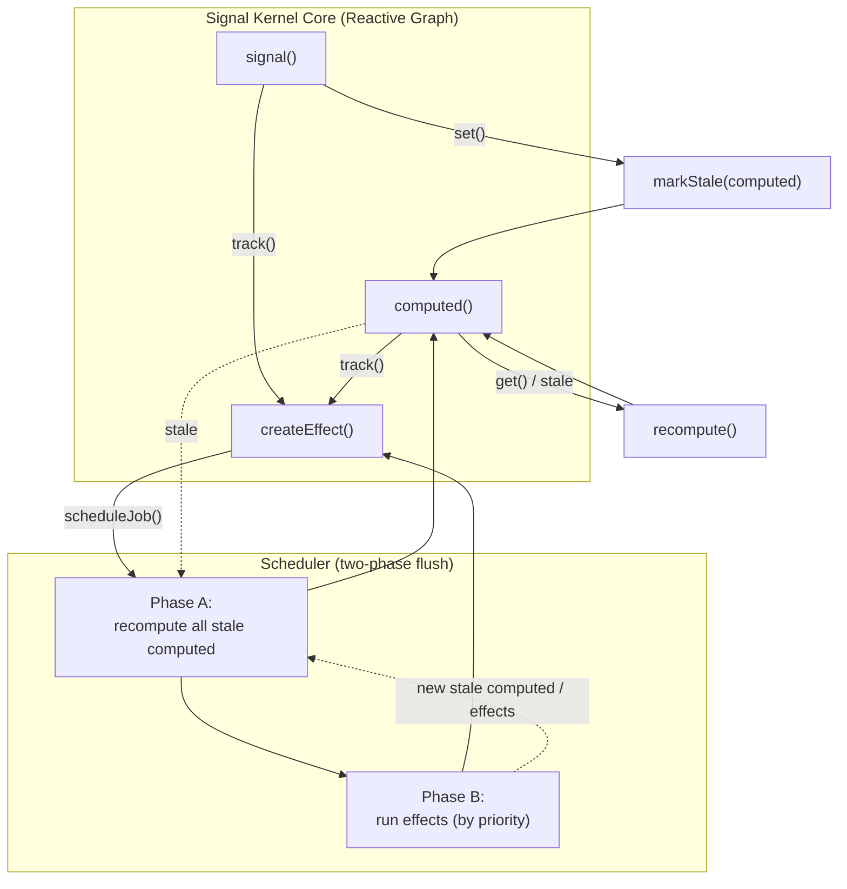

# `@signal-kernel/core`
### A minimal, deterministic, fine-grained reactivity engine.

`@signal-kernel/core` provides the foundational primitives for building reactive systems:
signals, computed values, effects, a deterministic scheduler, and a dependency graph.

This package is framework-agnostic and has no DOM or framework dependencies, making it suitable for:
- UI frameworks (via adapters)  
- Server-side reactive pipelines  
- Async dataflow runtimes  
- State machines & reactive graphs  
- Compiler-driven reactivity transforms  

It is the core runtime powering the broader Signal Kernel ecosystem.

---

# Installation
```bash
npm install @signal-kernel/core
```

---

# Overview
`@signal-kernel/core` implements a modern fine-grained reactive graph, consisting of:

1. **`signal()`**
    Mutable state unit, with dependency tracking and change propagation.  
2. **`computed()`**
    Lazy, memoized derivations with automatic dependency tracking.  
3. **`createEffect()`**
    Reactive side-effects with cleanup, disposal, and deterministic scheduling.  
4. **`batch()`**
    Coalesces multiple updates into a single scheduler flush.  
5. **Deterministic Scheduler**
    A two-phase flush model that first stabilizes computed nodes, then executes effects.  

All primitives are minimal yet expressive enough to build a complete reactivity system or compose higher-level runtimes (e.g., async pipelines).

---

# Public API
```ts
export { signal } from "./signal.js";
export { computed } from "./computed.js";
export { createEffect, onCleanup } from "./effect.js";
export { batch } from "./scheduler.js";
```

*(Internal APIs such as `atomic()`, `transaction()`, and `flushSync()` are intentionally not exported at this stage.)*

---
---------------------------------------------------------
# 1. `signal()`
---------------------------------------------------------

### Signature
```ts
const { get, set, subscribe, peek } = signal<T>(initial, equals?);
```

### Behavior
`get()`  
- Returns the current value.  
- If called within an active observer, registers a dependency via track().  

`set(next)`  
- Updates the stored value.  
- Uses a customizable equality comparator to prevent unnecessary propagation.  
- Notifies downstream:
    - computed nodes → marked stale  
    - effects → scheduled for execution  

`peek()`  
- Reads value without tracking dependencies.  

`subscribe(node)`  
Manually links an observer to the signal.
Useful for framework adapters (React/Vue/Solid) that manage their own lifecycle.  

**Key properties**  
- Signals **cannot depend** on others (enforced by runtime errors).  
- They are the leaf nodes of the reactive graph.  
- Changes propagate deterministically through the scheduler.  

---

---------------------------------------------------------
# 2. `computed()`
---------------------------------------------------------
### Signature
```ts
const { get, peek, dispose } = computed<T>(fn, equals?);
```

### Behavior
##### Lazy evaluation
Computed values only evaluate when `get()` is called.
If the node is stale—or has never computed before—it runs its `fn()` and updates dependencies.

##### Automatic dependency tracking
During execution, all accessed signals/computeds are recorded via `track()`.

##### Memoization & equality
A computed node only updates its value when:  
```rs
!equals(prev, next)
```

##### Stale propagation
When an upstream signal or computed changes:  
```ts
computed.stale = true;
```

Downstream effects are scheduled, but computation still occurs lazily.

##### Cycle detection
If a computed re-enters itself:  
```ts
throw new Error("Cycle detected in computed");
```

`dispose()`  
Fully removes the node from the graph:  
- Unlinks all deps and subs  
- Clears cached value  
- Leaves the graph consistent  

---

---------------------------------------------------------
# 3. `createEffect()`
---------------------------------------------------------
Effects are the imperative “side-effect” layer of the reactive system.

### Signature
```ts
const dispose = createEffect(() => {
  // ...
  return () => cleanup();
});
```

### Behavior

##### Automatic dependency tracking
During effect execution, reads from signals or computed values create graph edges via `track()`.

##### Cleanup handling
Before each re-run:  
1. All previous cleanups run  
2. All previous dependencies are removed  
3. The effect function re-executes and re-establishes its dependencies  

##### Disposal
Calling `dispose()`:  
- Runs remaining cleanups  
- Deletes the effect from the registry  
- Removes all graph links  
- Prevents future scheduling  

##### Integration with scheduler
Effects are not run synchronously—they are **scheduled**.
This ensures deterministic ordering and batching behavior.

---

---------------------------------------------------------
# 4. Scheduler
---------------------------------------------------------

Your runtime's scheduler is a defining feature.
It implements a two-phase deterministic flush, ensuring stable, predictable updates.

### Two-phase flush model


### Properties
- Computed nodes always stabilize before effects run.  
- Effects run in priority order.  
- No interleaving of computed and effect execution.  
- Infinite loops guarded by a safety counter.  
- Batching defers flush until the outermost batch completes.  

##### `batch()`
```ts
batch(() => {
  setA(1);
  setB(2);
});
```
Updates are collapsed; effects execute once.

##### Internal APIs (not exported)
- `atomic()`  
- `transaction()`  
- `flushSync()`  

These provide:  
- nested transaction support  
- rollback semantics  
- temporary scheduler muting  
- consistent reconciling of reactive state  

They are intentionally excluded from the public API until higher-level packages require them.

---

---------------------------------------------------------
# 5. Dependency Graph
---------------------------------------------------------
From `graph.ts`, each reactive node has:  
```ts
kind: "signal" | "computed" | "effect"
deps: Set<Node>
subs: Set<Node>
```

`track(dep)`  
Creates a directional edge:  
observer → dep  

`withObserver(observer, fn)`  
Temporarily sets the active observer during execution.  

`unlink(from, to)`  
Removes a dependency edge; used by effects and computed nodes on re-run.  

---

---------------------------------------------------------
# 6. Internal Architecture Diagram
---------------------------------------------------------


---

---------------------------------------------------------
# 7. Why This Runtime?
---------------------------------------------------------
Compared to other fine-grained reactive engines, Signal Kernel Core offers:  
### Deterministic scheduling
Computed nodes always settle before effects.  

### Lazy derivations
Computed values are only evaluated when needed.  

### Cycle detection
Prevents accidental recursive dependencies.  

### Zero framework assumptions
No VDOM, no compiler, no DOM APIs.  

### Adapter-friendly design
`subscribe()`, `onCleanup()`, and effect disposal make framework integration clean.  

### Extensibility
The internal architecture supports advanced features such as async pipelines, transactions, and server-side reactive graphs.  

---

---------------------------------------------------------
# 8. Summary
---------------------------------------------------------
`@signal-kernel/core` provides a minimal yet robust foundation for building reactive systems.
Its combination of:  
- signals  
- lazy computed values  
- deterministic effects  
- a two-phase scheduler  
- an explicit dependency graph  

